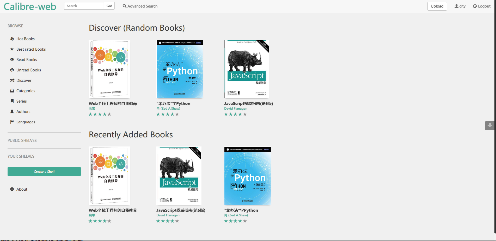
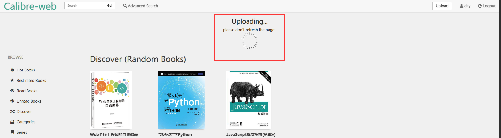
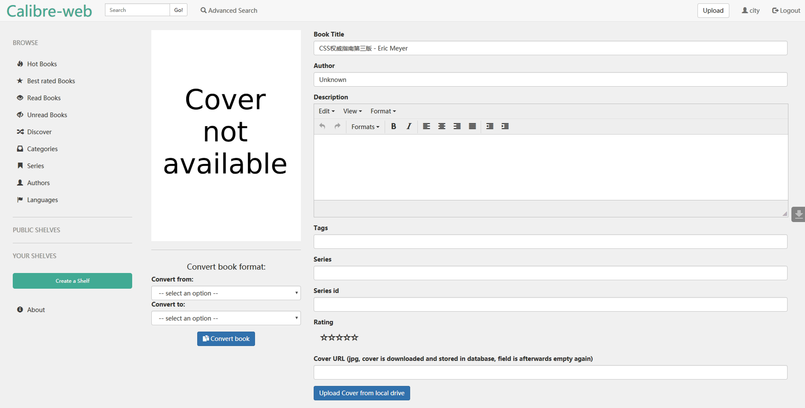
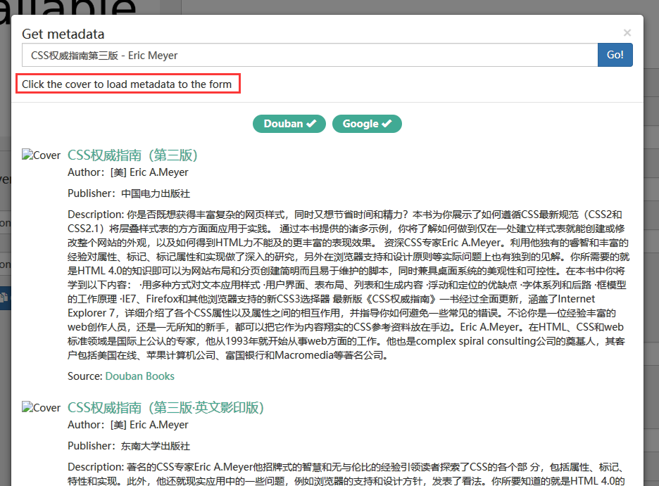
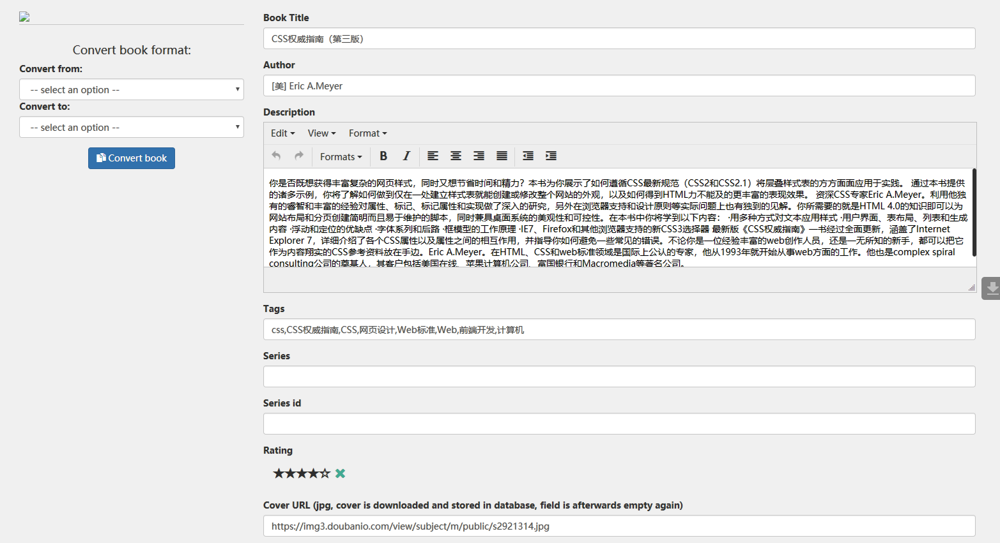
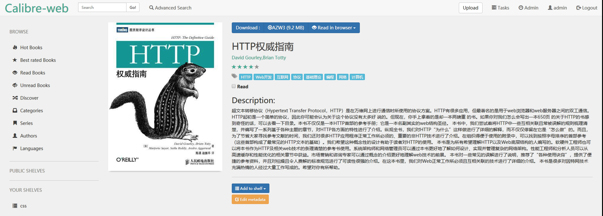
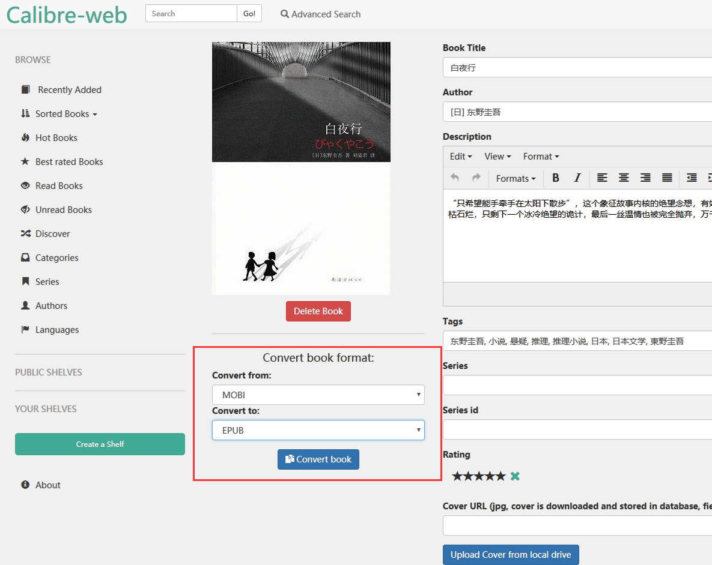
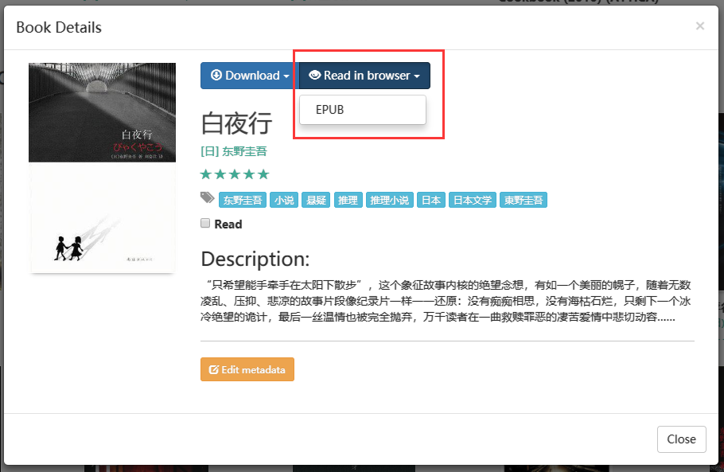

# Calibre-web的使用

edited by 王进波 2018.09.11

## 登录

地址：http://civgit.vicp.net/calibre-web

登录帐号：city/city

已开放注册，请大家用自己姓名的全拼注册，否则会删除帐号哈

## 上传

点击右上角`Upload`按钮可以上传电子书，上传成功前，不要刷新页面

 上传完成后，会自动跳转到书籍信息编辑的页面上，默认不包含电子书的元数据信息，需要手动编辑，页面上提供了豆瓣和google的接口，可以通过搜索书名指定书籍的封面，作者，描述等信息

翻到页面底部，找到`Get metadata` 按钮，如下图红框中所述，点击正确条目的封面以加载书籍元数据，页面上看到封面没有加载出来，不用管，根据数名和作者信息找到正确的条目，点击那个加载失败的图标

然后页面会回到编辑页，可以看到元数据已经自动填充了，图片没有加载，不用管，保存修改

回到书籍信息页面，`Add to shelf`，将书指定书架，以分类

## 浏览器在线阅读

支持浏览器在线阅读的电子书格式，目前发现有EPUB，所以如果你想在浏览器中直接打开一本电子书，而这个书恰巧不是EPUB格式的，那就需要进行格式转换。格式转换对PDF无效。

点击`Edit metadata`，编辑书籍元数据信息，从现有格式转换为EPUB

转换成功后，就可以在浏览器中阅读了

同事可以对书库中的内容做增删改查，质量不够的书就删掉，没有元数据信息的可以帮忙加上