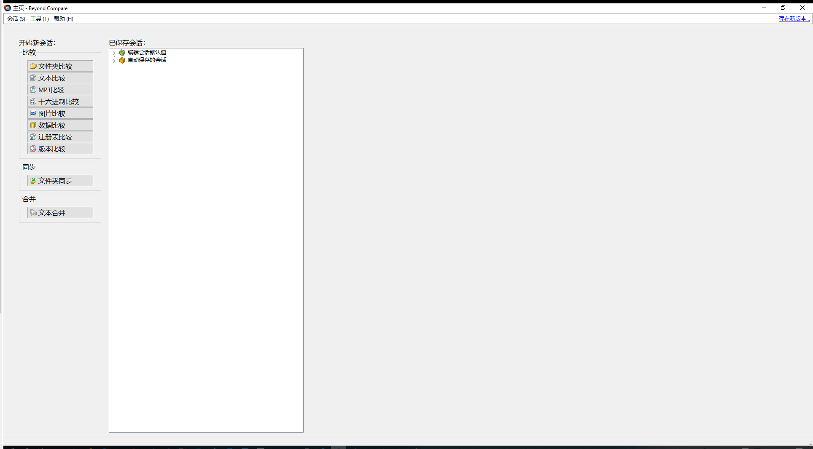
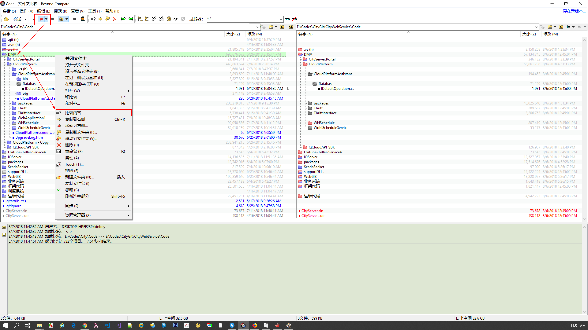
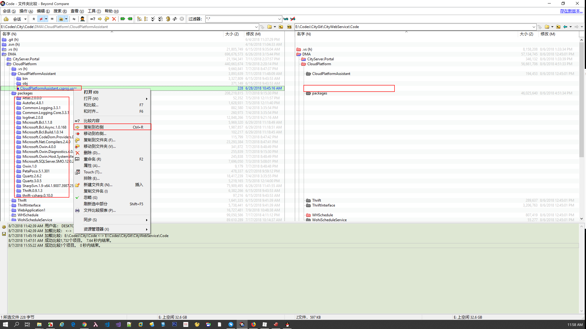
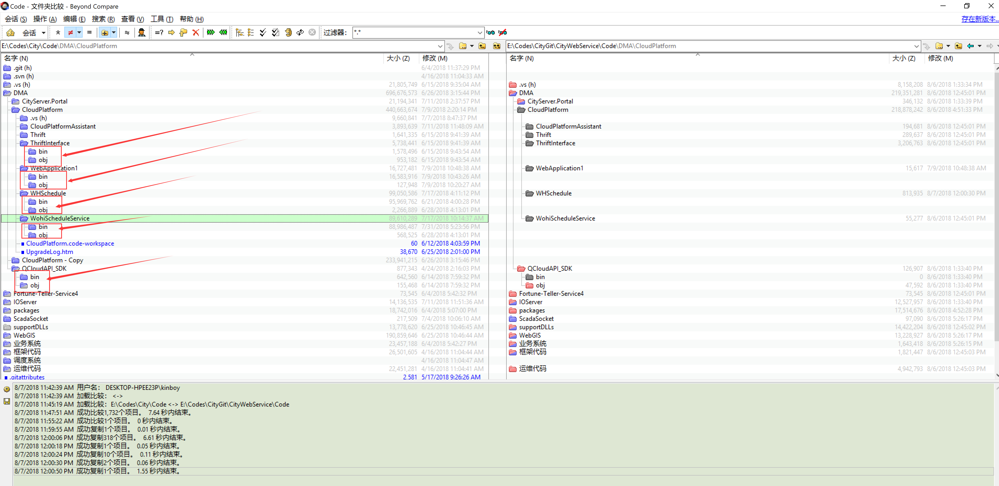

# 用BeyondCompare 同步代码

用[BeyondCompare](https://civgit.vicp.net:8443/wangjinbo/Svn-to-Git/blob/master/%E5%B7%A5%E5%85%B7/Beyond%20CompareHA.7z)工具对比自己本地SVN代码和从Gitlab clone下来的代码，将本机的改动手动更新到本地Git working copy

BeyondCompare工具我在本项目的工具文件夹中上传了，需要的可以自己[下载](https://civgit.vicp.net:8443/wangjinbo/Svn-to-Git/blob/master/%E5%B7%A5%E5%85%B7/Beyond%20CompareHA.7z)，或者去网上找

> 在这步操作过程中，我们优先同步自己修改的代码部分，对于代码内容存在差异的，如果是我们自己改的，能够判断哪边最新，就可以手动同步，如果不是我们修改的，不能判断的情况下，保留原样，不做修改，以Git目录为准就可以了

> 还有一处需要注意的是，如果存在一个项目或者一个文件夹，你本地开发环境里有，Git环境里没有的话，需要看这部分项目和文件夹是否是之前武汉中地的项目上的代码，因为我们在整理Git代码的时候已经将这一部分项目上的代码删掉了，注意不要在这个地方再次还原回去了
>
> 例如 ”Code/业务系统“ 下的的几个项目，在Git中已经被删除了
>
> - CityServer.Maintenance.ChengDu
> - CityServer.Maintenance.HZBJ
> - CityServer.Maintenance.SXBH
> - CityServer.Maintenance.Wujiang

> 在CityInterface项目中有很多文本内容相同，行尾结束符存在差异的情况，例如一边是UNIX一边是PC，或者一边是MIX一边是PC，**以PC为准**
>
> PC即Windows风格的CRLF，MIX是指当前文件存在UNIX与Windows风格混用的情况。

1. 打开BeyondCompare，对比文件夹
   

2. 在左右两侧地址栏输入对比的代码文件夹路径，打开对比
   
   红色为差异项，需要我们手动确认更新到Git本地working copy中

   

3. 将显示内容设置为显示差异项，然后在差异文件夹上右键，对比文件夹内容（对比文件二进制），然后二进制相同项就会自动隐藏，剩下的是需要我们手动打开查看内容的
   

4. 对于我们在本地开发环境中新增的文件或文件夹，如果不是编译产生的，则可以复制到Git目录一侧，如果是文件内容差异，我们可以将我们在文件中新增的内容复制到Git一侧
   

   

   这样的编译文件目录我们就不要拷贝了
   

   如此，最终我们就完成了将本地开发环境迁移到Git的过程了，建议大家暂时保留原有的开发环境，后续开发我们就可以在Git环境上完成了

   上面示例的是CityWebService的过程，Web4的过程相同。