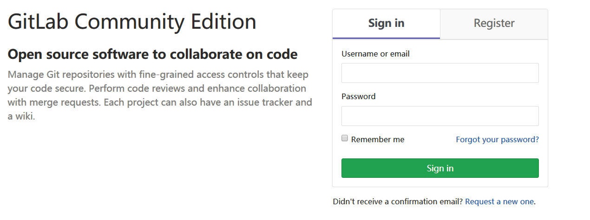
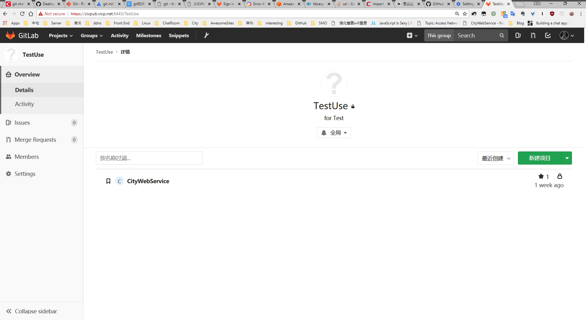
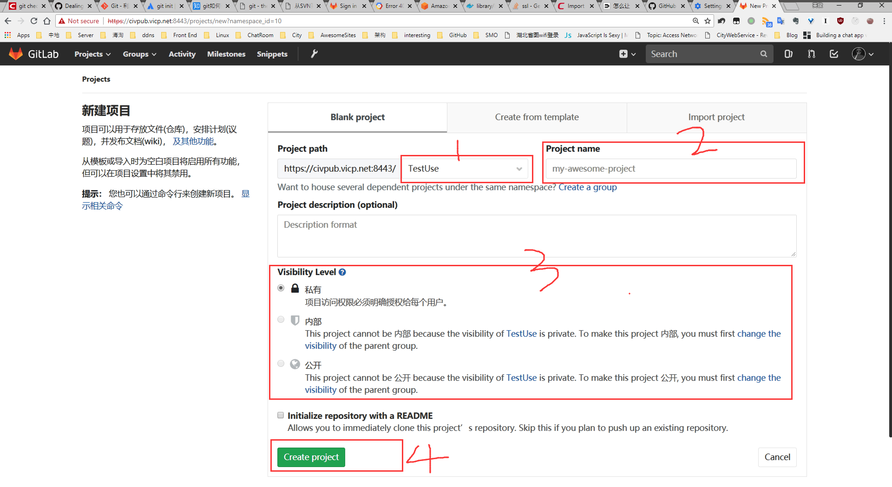
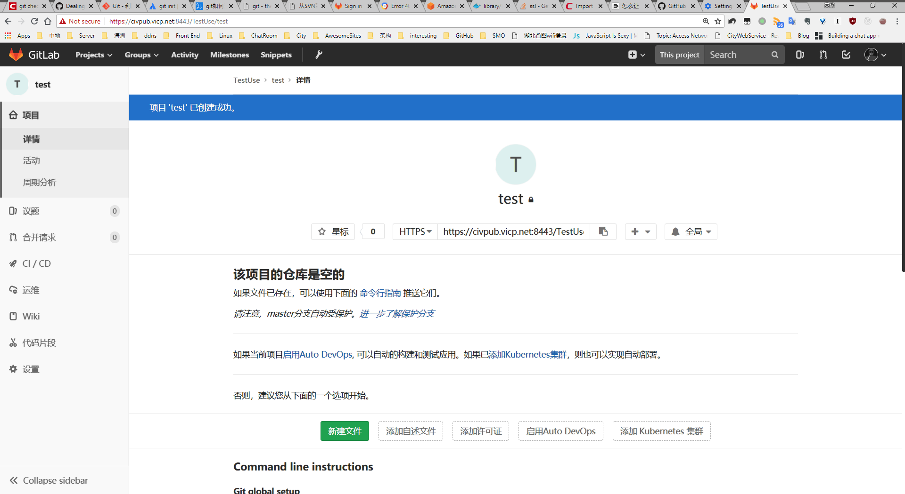
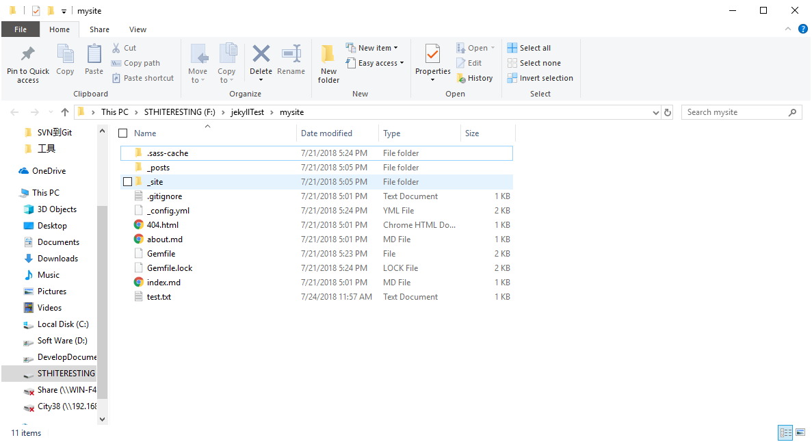
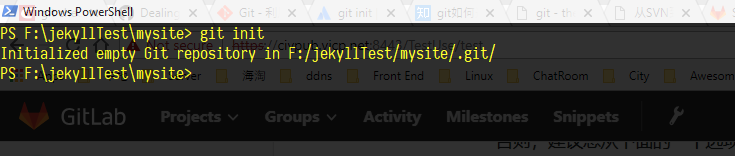
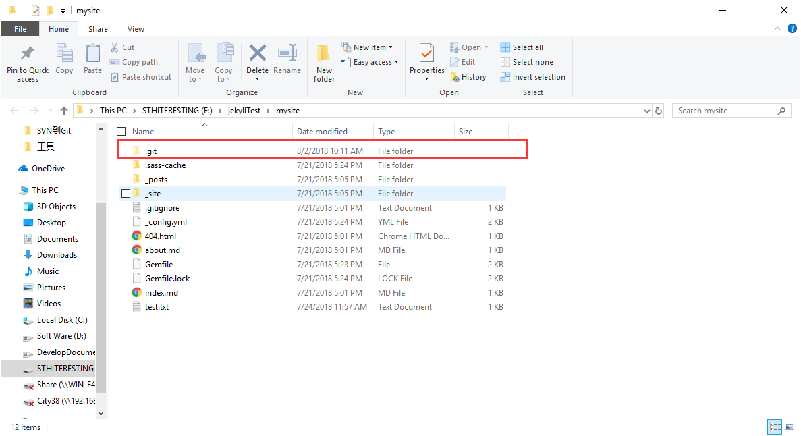
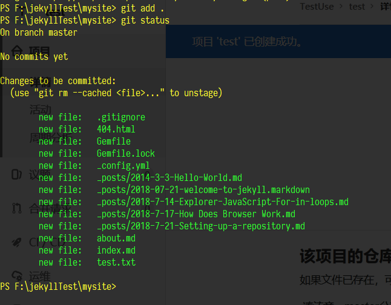
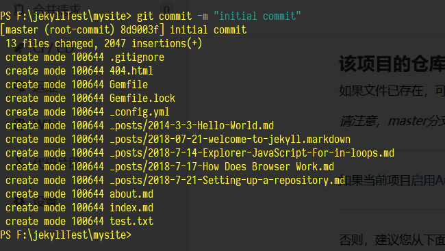
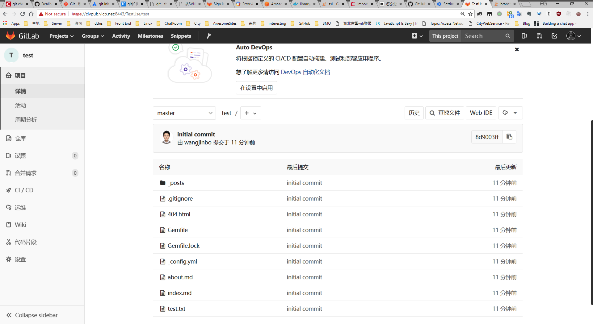

<!-- START doctoc generated TOC please keep comment here to allow auto update -->
<!-- DON'T EDIT THIS SECTION, INSTEAD RE-RUN doctoc TO UPDATE -->
**Table of Contents**  *generated with [DocToc](https://github.com/thlorenz/doctoc)*

- [创建新仓库](#%E5%88%9B%E5%BB%BA%E6%96%B0%E4%BB%93%E5%BA%93)
  - [登录Web前端](#%E7%99%BB%E5%BD%95web%E5%89%8D%E7%AB%AF)
  - [新建项目](#%E6%96%B0%E5%BB%BA%E9%A1%B9%E7%9B%AE)
  - [初始化本地仓库](#%E5%88%9D%E5%A7%8B%E5%8C%96%E6%9C%AC%E5%9C%B0%E4%BB%93%E5%BA%93)

<!-- END doctoc generated TOC please keep comment here to allow auto update -->

## 创建新仓库

### 登录Web前端



### 新建项目

先确定该项目是隶属于个人还是分组，如果是分组项目，则进入相应的分组下再创建项目




新建项目

> 1. 检查项目Url里的第二部分对应的分组名称是否正确，当该用户对多个分组有权限时，可能将项目创建到错误的分组中去，这里要检查一下
> 2. 为新项目命名
> 3. 确定项目的可见性等级
> 4. 创建项目




创建成功




### 初始化本地仓库

这一步是将本地已经存在的代码项目初始化成一个Git仓库

> 当我们上一步创建的Git项目还不存在时，我们只需要将空项目`clone`到本地，然后在本地的working copy 中添加代码，这与SVN是类似的


这是一个不包含 `.git` 文件夹的工程




```bash
cd /d F:\jekyllTest\mysite	#用命令行 cd 到这个路径下
git init	#执行初始化操作
```

提示初始化成功



我们再看看文件夹下面已经生成了`.git`文件夹



对于全新安装的Git·Windows ，我们还要进行一些初始化设置，记得吗，这里就再啰嗦一下

```bash
git config --global user.name wangjinbo			#全局添加作者名称
git config --global user.email vannue@qq.com	#全局添加用户邮箱

git config --global http.sslVerify false		#设置Git忽略ssl验证，免得我们用https下载代码会出错

git config --global core.autocrlf false		#关闭行尾结束符自动转换
git config --global core.safecrlf true		#打开安全crlf	
```

然后，我们要将Web前端创建的远程仓库的Url添加到本地的origin标识中

```shell
git remote add origin https://civgit.vicp.net:8443/TestUse/test.git	#这里我们默认使用https
git remote 	#该命令检查本地配置的远程标识，可能存在多个远程url
git remote -v	#查看当前远程url的详细信息
```

```shell
git add . 	#将当前目录下的所有文件和子文件夹内的文件添加到track版本控制，add命令在不同情景下含义不同，对新增文件还没有被track，add命令将其添加到版本控制，并添加到暂存区；对于已经被track的文件，add命令将修改添加到暂存区
git status 	#查看当前工作目录的状态
```



```shell
git commit -m "initial commit"	#提交暂存区中的修改，双引号内的内容为提交的注释
```



```shell
git push origin master	#将当前工作目录中的所有提交推送到远端仓库，origin指向了 https://civgit.vicp.net:8443/TestUse/test.git，master是新建仓库的默认分支，我们将代码提交到master分支
#master 分支是默认受保护分支，执行push操作需要用户具有高于Developer的权限
```

Powershell中完整的输入输出如下

```powershell
PS F:\jekyllTest\mysite> git init
Initialized empty Git repository in F:/jekyllTest/mysite/.git/
PS F:\jekyllTest\mysite>  git remote
PS F:\jekyllTest\mysite> git remote add origin https://civgit.vicp.net:8443/TestUse/test.git
PS F:\jekyllTest\mysite> git remote
origin
PS F:\jekyllTest\mysite> git add .
PS F:\jekyllTest\mysite> git commit -a
Aborting commit due to empty commit message.
PS F:\jekyllTest\mysite> git commit -m "initial commit"
[master (root-commit) 48e9af5] initial commit
 13 files changed, 2047 insertions(+)
 create mode 100644 .gitignore
 create mode 100644 404.html
 create mode 100644 Gemfile
 create mode 100644 Gemfile.lock
 create mode 100644 _config.yml
 create mode 100644 _posts/2014-3-3-Hello-World.md
 create mode 100644 _posts/2018-07-21-welcome-to-jekyll.markdown
 create mode 100644 _posts/2018-7-14-Explorer-JavaScript-For-in-loops.md
 create mode 100644 _posts/2018-7-17-How Does Browser Work.md
 create mode 100644 _posts/2018-7-21-Setting-up-a-repository.md
 create mode 100644 about.md
 create mode 100644 index.md
 create mode 100644 test.txt
PS F:\jekyllTest\mysite> start .
PS F:\jekyllTest\mysite> start .
PS F:\jekyllTest\mysite> git init
Initialized empty Git repository in F:/jekyllTest/mysite/.git/
PS F:\jekyllTest\mysite> git remote -v
PS F:\jekyllTest\mysite> git remote add origin https://civgit.vicp.net:8443/TestUse/test.git
PS F:\jekyllTest\mysite> git remote -v
origin  https://civgit.vicp.net:8443/TestUse/test.git (fetch)
origin  https://civgit.vicp.net:8443/TestUse/test.git (push)
PS F:\jekyllTest\mysite> git add .
PS F:\jekyllTest\mysite> git status
On branch master

No commits yet

Changes to be committed:
  (use "git rm --cached <file>..." to unstage)

        new file:   .gitignore
        new file:   404.html
        new file:   Gemfile
        new file:   Gemfile.lock
        new file:   _config.yml
        new file:   _posts/2014-3-3-Hello-World.md
        new file:   _posts/2018-07-21-welcome-to-jekyll.markdown
        new file:   _posts/2018-7-14-Explorer-JavaScript-For-in-loops.md
        new file:   _posts/2018-7-17-How Does Browser Work.md
        new file:   _posts/2018-7-21-Setting-up-a-repository.md
        new file:   about.md
        new file:   index.md
        new file:   test.txt

PS F:\jekyllTest\mysite> git commit -m "initial commit"
[master (root-commit) 8d9003f] initial commit
 13 files changed, 2047 insertions(+)
 create mode 100644 .gitignore
 create mode 100644 404.html
 create mode 100644 Gemfile
 create mode 100644 Gemfile.lock
 create mode 100644 _config.yml
 create mode 100644 _posts/2014-3-3-Hello-World.md
 create mode 100644 _posts/2018-07-21-welcome-to-jekyll.markdown
 create mode 100644 _posts/2018-7-14-Explorer-JavaScript-For-in-loops.md
 create mode 100644 _posts/2018-7-17-How Does Browser Work.md
 create mode 100644 _posts/2018-7-21-Setting-up-a-repository.md
 create mode 100644 about.md
 create mode 100644 index.md
 create mode 100644 test.txt
PS F:\jekyllTest\mysite> git status
On branch master
nothing to commit, working tree clean
PS F:\jekyllTest\mysite> git push origin master
Counting objects: 16, done.
Delta compression using up to 8 threads.
Compressing objects: 100% (15/15), done.
Writing objects: 100% (16/16), 41.37 KiB | 3.76 MiB/s, done.
Total 16 (delta 0), reused 0 (delta 0)
remote: GitLab: You are not allowed to push code to protected branches on this project.
To https://civgit.vicp.net:8443/TestUse/test.git
 ! [remote rejected] master -> master (pre-receive hook declined)
error: failed to push some refs to 'https://civgit.vicp.net:8443/TestUse/test.git'
PS F:\jekyllTest\mysite>
#最后这里因为我用wangjinbo这个用户执行的push到master分支的操作，wangjinbo在test组的权限是developer，developer不允许向master推送提交
```

进Web前端，查看代码，成功

 