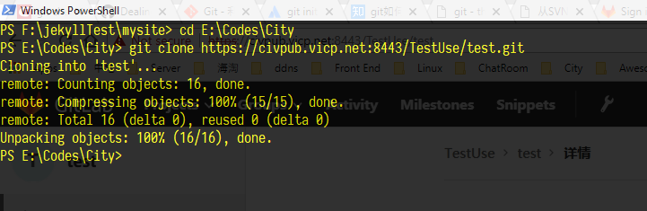
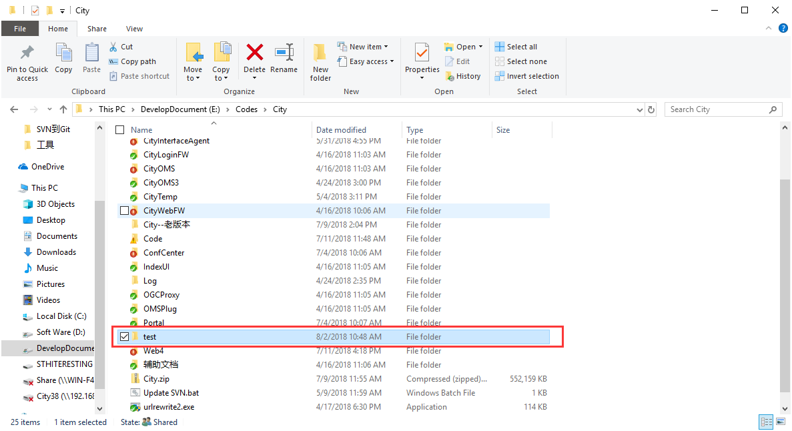
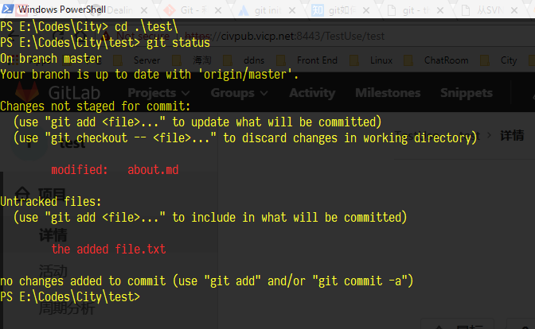
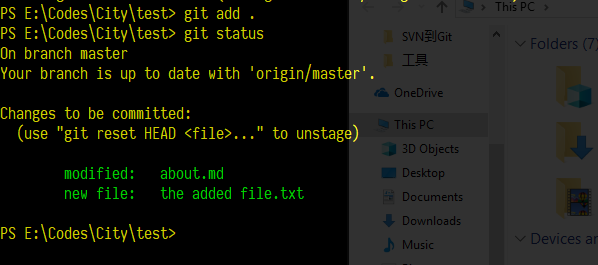
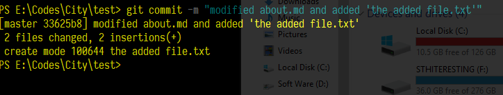
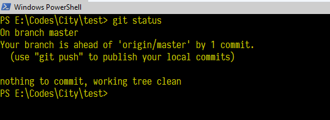
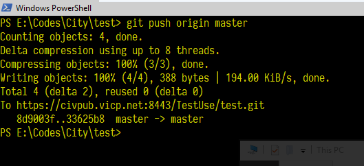

<!-- START doctoc generated TOC please keep comment here to allow auto update -->
<!-- DON'T EDIT THIS SECTION, INSTEAD RE-RUN doctoc TO UPDATE -->
**Table of Contents**  *generated with [DocToc](https://github.com/thlorenz/doctoc)*

- [命令行演示常用操作](#%E5%91%BD%E4%BB%A4%E8%A1%8C%E6%BC%94%E7%A4%BA%E5%B8%B8%E7%94%A8%E6%93%8D%E4%BD%9C)
  - [git clone - 远程仓库](#git-clone---%E8%BF%9C%E7%A8%8B%E4%BB%93%E5%BA%93)
  - [修改文档](#%E4%BF%AE%E6%94%B9%E6%96%87%E6%A1%A3)
  - [git add - 添加修改到暂存区](#git-add---%E6%B7%BB%E5%8A%A0%E4%BF%AE%E6%94%B9%E5%88%B0%E6%9A%82%E5%AD%98%E5%8C%BA)
  - [git commit - 提交暂存区地修改](#git-commit---%E6%8F%90%E4%BA%A4%E6%9A%82%E5%AD%98%E5%8C%BA%E5%9C%B0%E4%BF%AE%E6%94%B9)
  - [git fetch - 拉取远程分支数据到本地](#git-fetch---%E6%8B%89%E5%8F%96%E8%BF%9C%E7%A8%8B%E5%88%86%E6%94%AF%E6%95%B0%E6%8D%AE%E5%88%B0%E6%9C%AC%E5%9C%B0)
  - [git pull - 取回并合并远程主机某个分支的更新到本地](#git-pull---%E5%8F%96%E5%9B%9E%E5%B9%B6%E5%90%88%E5%B9%B6%E8%BF%9C%E7%A8%8B%E4%B8%BB%E6%9C%BA%E6%9F%90%E4%B8%AA%E5%88%86%E6%94%AF%E7%9A%84%E6%9B%B4%E6%96%B0%E5%88%B0%E6%9C%AC%E5%9C%B0)
    - [高级特性](#%E9%AB%98%E7%BA%A7%E7%89%B9%E6%80%A7)
  - [git push - 推送本地提交到远程分支](#git-push---%E6%8E%A8%E9%80%81%E6%9C%AC%E5%9C%B0%E6%8F%90%E4%BA%A4%E5%88%B0%E8%BF%9C%E7%A8%8B%E5%88%86%E6%94%AF)
- [](#)

<!-- END doctoc generated TOC please keep comment here to allow auto update -->

## 命令行演示常用操作

### git clone - 远程仓库

这一步是我们开始用git的第一步操作，因为我们之前SVN中的代码全都迁到了Git，大家开始工作第一步就是从Git仓库里面下载代码到本地，这一步与SVN类似。

```shell
cd /d E:\Codes\City #我们先用CMD命令行的CD命令导航到我们习惯存放代码的路径下
git clone https://civgit.vicp.net:8443/TestUse/test.git CityTest #clone远程仓库
```



现在我们就可以看到下载下来的本地工作目录了



### 修改文档

现在我们可以开始工作了，我们新增一些文件，然后修改一些文件，删除一些文件

### git add - 添加修改到暂存区

然后我们需要将修改`add`到暂存区，然后完成`commit` 提交和`push`推送

```shell
cd test	#导航到工作目录，不然无法执行git命令的，会提示当前目录非git目录
git status	#经常执行这个命令是个好习惯
```

git status 命令列出了我们当前工作目录下所作的全部修改

我们可以看到包含了两个部分，第一个部分列出了我们修改的文件

> Changes not staged for commit:
>   (use "git add <file>..." to update what will be committed)
>   (use "git checkout -- <file>..." to discard changes in working directory)
>
> ​	 modified:   about.md

第二个部分列出了我们新增的一个文件，由于是新增的，我们还没有对它进行版本控制，即track

> Untracked files:
>   (use "git add <file>..." to include in what will be committed)
>
> ​    the added file.txt



我们执行`git add` 命令将这两处改动添加到暂存区

```shell
git add .	#这里 ‘.’ 符号是一个用通配符批量添加的方式，我们也可以将 ‘.’替换成单个改动文件的路径来针对性添加
git status	#添加完成后检查状态，好习惯
```



绿色标识添加操作成功，这是非常符合我们一般习惯的表达，然后它还温馨地给出了提示，如果需要撤销暂存操作，执行

```shell
git reset HEAD <file>...
```

### git commit - 提交暂存区地修改

现在我们将暂存区中地修改进行一次提交

```shell
git commit -m "modified about.md and added 'the added file.txt'"
git status	
```



git status 命令告诉我们，没有当前工作目录没有需要提交地修改了，并且告诉我们，我们比"origin/master"超前了一次提交，这里“origin/master”就是指远端仓库地master 分支，区别于我们本地分支




### git fetch - 拉取远程分支数据到本地

先更新再提交！先更新再提交！先更新再提交！

这是我们在用SVN的时候常常强调的一句话。也是一种减少冲突的策略。

在Git下，当我们准备push本地分支上的修改到远程分支的时候，我们也要建议大家先将远程分支的代码拉到本地。

一旦远程主机的版本库有了更新（Git术语叫做commit），需要将这些更新取回本地，这时就要用到`git fetch`命令。 

`git fetch`命令通常用来查看其他人的进程，因为它取回的代码对你本地的开发代码没有影响。 

默认情况下，`git fetch`取回所有分支（branch）的更新。如果只想取回特定分支的更新，可以指定分支名。 

所取回的更新，在本地主机上要用"远程主机名/分支名"的形式读取。比如`origin`主机的`master`，就要用`origin/master`读取。 

```shell
git fetch <远程主机名>  <分支名>	#目前我们的远程主机名是指origin，远程分支名是master
```

取回远程主机的更新以后，可以在它的基础上，使用`git checkout`命令创建一个新的分支。

```shell
 git checkout -b newBrach origin/master
```

上面命令表示，在`origin/master`的基础上，创建一个新分支，名字叫newBranch。

此外，也可以使用`git merge`命令或者`git rebase`命令，在本地分支上合并远程分支。

```shell
$ git merge origin/master
# 或者
$ git rebase origin/master	#我们建议用rebase
```

上面命令表示在当前分支上，合并`origin/master`。

### git pull - 取回并合并远程主机某个分支的更新到本地

 `git pull`命令的作用是，取回远程主机某个分支的更新，再与本地的指定分支合并。它的完整格式稍稍有点复杂。 

```shell
git pull <远程主机名> <远程分支名>:<本地分支名>
```

比如，取回`origin`主机的`next`分支，与本地的`master`分支合并，需要写成下面这样。

```shell
git pull origin next:master
```

如果远程分支是与当前分支合并，则冒号后面的部分可以省略。

```shell
git pull origin next
```

上面命令表示，取回`origin/next`分支，再与当前分支合并。实质上，这等同于先做`git fetch`，再做`git merge`。

```shell
git fetch origin
git merge origin/next
```


#### 高级特性

在某些场合，Git会自动在本地分支与远程分支之间，建立一种追踪关系（tracking）。比如，在`git clone`的时候，所有本地分支默认与远程主机的同名分支，建立追踪关系，也就是说，本地的`master`分支自动"追踪"`origin/master`分支。

Git也允许手动建立追踪关系。

```shell
git branch --set-upstream master origin/next
```


上面命令指定`master`分支追踪`origin/next`分支。

如果当前分支与远程分支存在追踪关系，`git pull`就可以省略远程分支名。

```shell
git pull origin
```


上面命令表示，本地的当前分支自动与对应的`origin`主机"追踪分支"（remote-tracking branch）进行合并。

如果当前分支只有一个追踪分支，连远程主机名都可以省略。

```shell
git pull
```


上面命令表示，当前分支自动与唯一一个追踪分支进行合并。

如果合并需要采用rebase模式，可以使用`--rebase`选项。

```shell
git pull --rebase <远程主机名> <远程分支名>:<本地分支名>
```


如果远程主机删除了某个分支，默认情况下，`git pull` 不会在拉取远程分支的时候，删除对应的本地分支。这是为了防止，由于其他人操作了远程主机，导致`git pull`不知不觉删除了本地分支。

但是，你可以改变这个行为，加上参数 `-p` 就会在本地删除远程已经删除的分支。

```shell
git pull -p
# 等同于下面的命令
git fetch --prune origin 
git fetch -p
```


### git push - 推送本地提交到远程分支

最后一步，我们将提交（commit）推送到远程仓库，与SVN不同，我们大部分修改和提交都在自己地本地分支上操作，不需要频繁地与远程仓库交互，所以这一步，我们不需要每次commit之后就push一下，一般我们认为阶段性修改完成了之后推翻送到服务端，或者下班地时候，处于安全考虑我们将本地修改同步到远端，也起到了备份地作用

```shell
git push origin master
```




## 