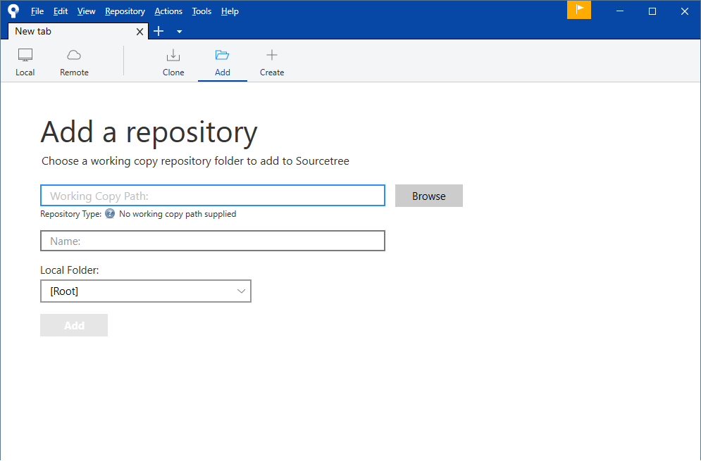
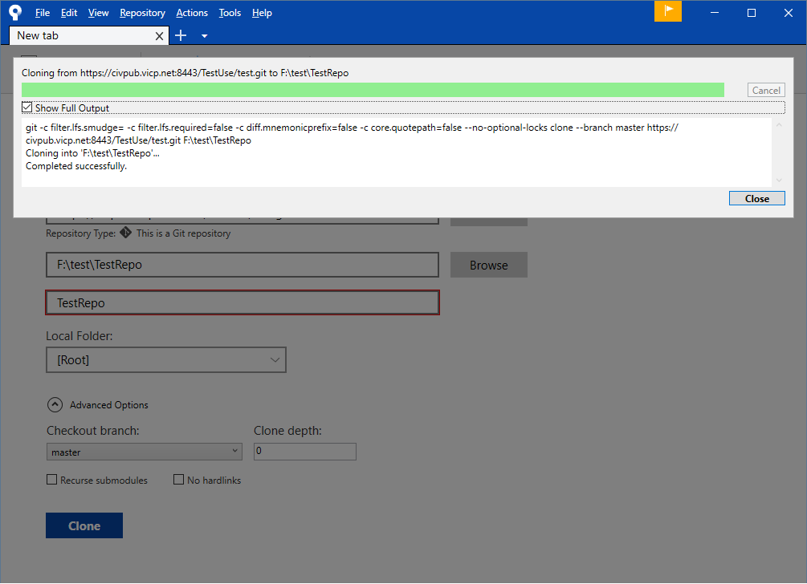

<!-- START doctoc generated TOC please keep comment here to allow auto update -->
<!-- DON'T EDIT THIS SECTION, INSTEAD RE-RUN doctoc TO UPDATE -->
**Table of Contents**  *generated with [DocToc](https://github.com/thlorenz/doctoc)*

- [图形界面的Git - SourceTree](#%E5%9B%BE%E5%BD%A2%E7%95%8C%E9%9D%A2%E7%9A%84git---sourcetree)
  - [先看看SourceTree的界面](#%E5%85%88%E7%9C%8B%E7%9C%8Bsourcetree%E7%9A%84%E7%95%8C%E9%9D%A2)
    - [Local](#local)
    - [Remote](#remote)
    - [Clone](#clone)
    - [Add](#add)
    - [Create](#create)
  - [clone 仓库到本地](#clone-%E4%BB%93%E5%BA%93%E5%88%B0%E6%9C%AC%E5%9C%B0)
  - [修改文件](#%E4%BF%AE%E6%94%B9%E6%96%87%E4%BB%B6)
  - [add 修改到暂存区](#add-%E4%BF%AE%E6%94%B9%E5%88%B0%E6%9A%82%E5%AD%98%E5%8C%BA)
  - [commit 提交暂存区的修改](#commit-%E6%8F%90%E4%BA%A4%E6%9A%82%E5%AD%98%E5%8C%BA%E7%9A%84%E4%BF%AE%E6%94%B9)
  - [push 将本地分支推送到远程分支](#push-%E5%B0%86%E6%9C%AC%E5%9C%B0%E5%88%86%E6%94%AF%E6%8E%A8%E9%80%81%E5%88%B0%E8%BF%9C%E7%A8%8B%E5%88%86%E6%94%AF)

<!-- END doctoc generated TOC please keep comment here to allow auto update -->

## 图形界面的Git - SourceTree

### 先看看SourceTree的界面

#### Local

展示已经添加到SourceTree管理目录的本地仓库

#### Remote

展示我们通过关联第三方账号连接的第三方Git托管服务里的远程仓储，如图，我们在SourceTree上登陆GitHub账号后，就可以浏览我们在Github上拥有的仓库，也可以进行clone操作。

#### Clone

将远程仓库clone到本地，这一步操作与我们在命令行界面下执行 `git clone` 的过程是一样的

#### Add

添加本地的Git仓库到SourceTree的管理目录，添加后我们就可以在Local下面看到这个仓库了

#### Create

创建新的本地Git仓库，这个过程类似我们在命令行界面执行 `git init`

### clone 仓库到本地

如果你本地还没有工作拷贝，就需要从远程仓库下载代码到本地，这个时候，安装并打开SourceTree，打开Clone选项，输入参数

> Source Path/Url：远程仓库Url
>
> Destination Path：本地目标目录(必须是一个空目录)
>
> Name：SourceTree的标签名称，即SourceTree会为你的本地仓库命名一个别称，也可以和Git仓库名称保持一致

成功

在这个界面上我们就可以方便地查看本地仓库当前状态，完成 `add` `commit` `push` `branch` `merge` `fetch` `pull` `rebase` 等等操作。

### 修改文件

和上面命令行界面中一样，我们clone仓库到本地后就可以开始进行开发了，添加文件，修改文件，删除文件等，然后再在SourceTree中添加修改到缓存区，提交缓存区的修改，将已完成的提交push到远程分支等操作。

这里我们在本地仓库中新增一个文件，修改一个文件，删除一个文件

完成修改后，当我们将窗口切换到SourceTree的界面的时候，SourceTree会自动执行`git status`命令，并将结果可视化地输出到界面上来

我们可以大致将界面划分成几个区域，来学习一下不同区域的主要功能。

> - 1号区域是基本操作区，包含了我们命令行里常用的几个命令等同的操作，界面的好处是比较容易上手，但是缺点是很多新手会在不了解的情况下先习惯性地点一点试试，这是不好的习惯。我们推荐命令行是因为我们通常对陌生的东西会更加谨慎，当我们敲下命令的时候，我们会尽量先了解下我们正在做什么。关于分支合并的操作，我们希望大家谨慎操作，先去官网的pro git教程上学习一下，上面有非常详尽的介绍和情景演示。
> - 2号区域列出了工作目录，本地仓库分支，远程仓库分支，标签，和暂存，方便我们切换到不同维度去查看代码
> - 3号区域是Git的提交分支历史树
> - 4号区域，5号区域和6号区域用来查看当前工作目录的已add到暂存区的修改，未add到暂存区的修改，以及单个文件修改的详细内容。4，5，6号区域在我们选择2号区域中不同维度时会有变化，功能大致相同。

在上面截图的5号区域可以看到我们在上一步修改文件的步骤中设计的文件修改，一共有3项修改

> - 黄色的about.md 图标为三个点号，意为modified，即内容被修改的文件
> - 灰色的test.txt 图标为减号，意思是删除的文件
> - 紫色的newAdded.txt 图标为问号，意思是untracked，没有加入版本控制的文件

### add 修改到暂存区

和命令行一样，我们需要将修改添加到暂存区，红框所示，可以选择全部stage还是选择性stage，这里stage就是添加到暂存区的意思

我们Stage all以后，三项修改就被添加到暂存区了

### commit 提交暂存区的修改

SourceTree在Commit修改的时候也需要写注释，界面工具也为我们提供了一些可选的提交选项，我们可以根据需要来配置。

提交后，切换到Log/History界面，可以看到本次提交已经生成，在分支提交历史树上也可以看到我们这次的提交，然后再顶部Push按钮上显示了一个蓝色的上标，数字为1，标识有一个可执行的push

### push 将本地分支推送到远程分支

点击Push按钮，弹出Push对话框，默认只有一个master分支，本地也是master分支，我们将本地master分支push到远程master分支，即origin/master。

push成功

