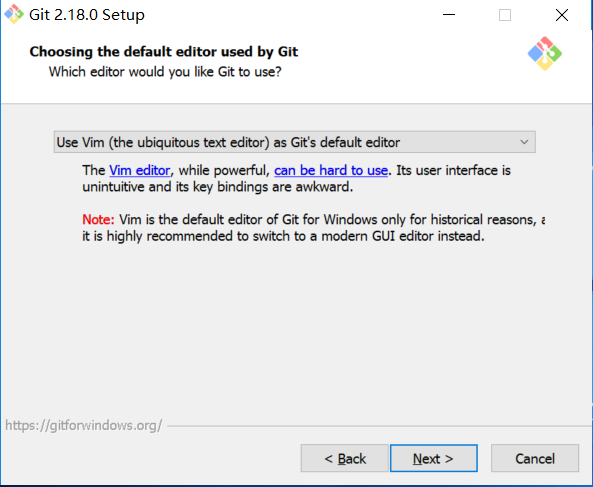

<!-- START doctoc generated TOC please keep comment here to allow auto update -->
<!-- DON'T EDIT THIS SECTION, INSTEAD RE-RUN doctoc TO UPDATE -->
**Table of Contents**  *generated with [DocToc](https://github.com/thlorenz/doctoc)*

- [安装Git-Windows](#%E5%AE%89%E8%A3%85git-windows)
  - [开始安装界面](#%E5%BC%80%E5%A7%8B%E5%AE%89%E8%A3%85%E7%95%8C%E9%9D%A2)
  - [安装路径](#%E5%AE%89%E8%A3%85%E8%B7%AF%E5%BE%84)
  - [建议全选](#%E5%BB%BA%E8%AE%AE%E5%85%A8%E9%80%89)
  - [菜单文件夹](#%E8%8F%9C%E5%8D%95%E6%96%87%E4%BB%B6%E5%A4%B9)
  - [选择Git默认编辑器](#%E9%80%89%E6%8B%A9git%E9%BB%98%E8%AE%A4%E7%BC%96%E8%BE%91%E5%99%A8)
  - [修改系统环境变量](#%E4%BF%AE%E6%94%B9%E7%B3%BB%E7%BB%9F%E7%8E%AF%E5%A2%83%E5%8F%98%E9%87%8F)
  - [SSL证书的选择](#ssl%E8%AF%81%E4%B9%A6%E7%9A%84%E9%80%89%E6%8B%A9)
  - [配置行尾结束符](#%E9%85%8D%E7%BD%AE%E8%A1%8C%E5%B0%BE%E7%BB%93%E6%9D%9F%E7%AC%A6)
  - [配置 Git 终端](#%E9%85%8D%E7%BD%AE-git-%E7%BB%88%E7%AB%AF)
  - [剩下的步骤默认就好了](#%E5%89%A9%E4%B8%8B%E7%9A%84%E6%AD%A5%E9%AA%A4%E9%BB%98%E8%AE%A4%E5%B0%B1%E5%A5%BD%E4%BA%86)

<!-- END doctoc generated TOC please keep comment here to allow auto update -->

## 安装Git-Windows

Git-Windows [下载地址](https://git-scm.com/) ，在Git官网找到下载的链接 ，下载对应操作系统版本的 Git 安装包。虽然提供了下载好的安装程序，但是仍然建议大家自己动手去熟悉这个过程。

> Git-Windows 安装过程如下，Git-Windows是Windows版本的命令行 Git 客户端工具，安装完以后就可以在命令行中完成大多数代码同步操作

### 开始安装界面

 

### 安装路径

 

### 建议全选

 

### 菜单文件夹

### 选择Git默认编辑器

- 默认Vim，建议选择Notepad++或者vscode这样的图形化界面的工具作为编辑器，Vim是一个命令行的编辑器，不会的可能需要学习。

### 修改系统环境变量

- 默认选中间那个，建议从上面两个选项二选一

 

### SSL证书的选择

- 默认选上面那个

### 配置行尾结束符

- **这个地方请大家选择第三个** ，这里是一个巨坑，请注意 !!!!!!!!
- 不同操作系统下的换行符有不同规范，Windows使用CRLF（即回车 + 换行： \r\n）结束一行，Mac和 Linux下使用LF（即换行：\r）结束一行。
- 我们目前基本在Windows平台上开发和部署，不涉及跨平台问题，过去我们在编辑器（VS）中一般默认使用的是CRLF行尾结束符，过去我们使用的 SVN 仓库里也是使用的 CRLF，因此目前我们在 Git 中继续使用 CRLF 规范，作为开发者，我们需要统一规范，避免代码中出现行尾结束符混用的问题。
- Git 一开始是用于管理Linux内核代码的，后来推广开以后，为了兼容Windows操作系统，它提供了一些行尾结束符转换的策略，这些策略可以在我们 `检出` 和 `commit` 代码的时候，由Git自动帮助我们完成 CRLF 和 LF 的转换。
- 这个地方，我们不采用用 Git 的自动转换策略，我们希望在 `检出` 和 `commit` 代码的时候保留代码原有的行尾结束符。

 

### 配置 Git 终端

- 这里不了解的可以选择第一项，这个地方我选的第二项，没有出现异常

 

### 剩下的步骤默认就好了

- 装好以后我们在桌面上就可以看到一个Git  Bash的快捷方式，这是一个ssh的命令行工具，打开它我们就可以在这里面用命令行完成大部分Git操作

- 同样的，我们也可以用Windows的 CMD 命令行工具来执行 Git 命令

  

### 安装完成以后需要执行的配置

第一步，配置 Git 的用户名和邮箱，这两项配置会在我们提交代码时被添加到提交信息中，这样我们查看历史的时候就可以看到这个提交作者的信息了，这两项时Git必须的设置

- `git config --global user.name <你的名字>`
- `git config --global user.email <你的邮箱地址>`

  

第二步，需要关闭 HTTPS 的验证，我们的Gitlab Server 的 HTTPS 使用的 ssl 证书是我们自己签发的，没有经过证书机构，因此当我们在浏览器中打开 `https://civpub.vicp.net:8443 ` 的时候会因为证书不可信被浏览器提示危险网站 ，同样，我们在用 Git 通过 Https 协议下载代码的时候，Git 也会对 Https 的 ssl 证书进行验证，这时候会因为证书不可信而中断，我们需要手动把这一步验证关掉，在命令行中执行下面的配置操作，然后重新 `clone` 

- `git config --global http.sslVerify false` 

  

第三步，检查我们的`core.autocrlf` 和 `core.safecrlf` 配置是否正确
- `git config --global core.autocrlf false` 要设置为false，这样 Git 会按照原样 `检出`和 `commit`代码，不会自动转换
- `git config --global core.safecrlf true` 要设置为true，当 Git 检测到我们的代码中存在 `CRLF`  和 `LF` 混用的情况时会组织我们提交。

