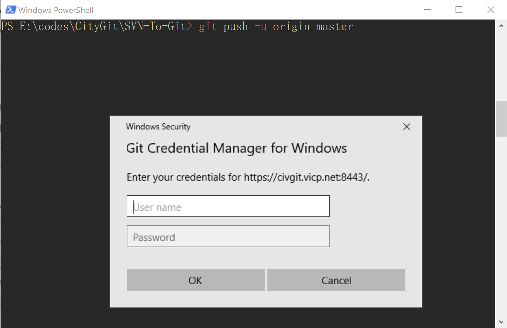

# Git使用HTTP(s)同步时修改验证信息

第一次使用 Git `clone` 仓库时，如果你选择的Url是HTTP或HTTPs协议的，当你敲完`git clone <Url>` 的命令按下回车键后，会弹出一个登录框，要求你输入Git托管服务的登录帐号，在这里，我们的Git托管服务就是Gitlab的登录帐号。

假如这一步你不小心输入了错误的用户名或者密码，就会被提示验证失败，同时，错误的验证信息会被Windows保存起来，当你重新执行Git请求的时候，错误的验证信息会被自动使用，而不会让你重新输入

这时我们需要手动更改Windows中保存的错误的验证信息，位置在`系统设置-管理windows凭据`中，如下图，找到对应的Git 的Url，可以edit 或者remove。

