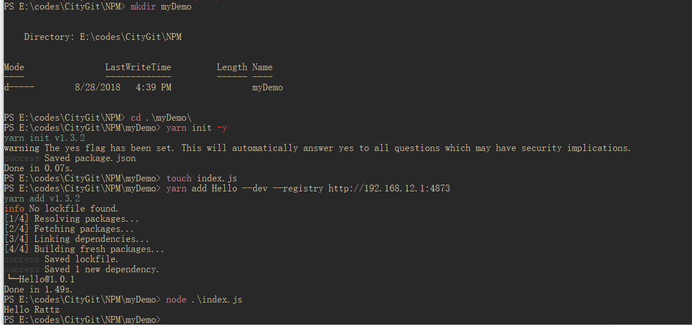

### 使用 Docker 搭建私有NPM仓库

> 关于 Docker 的使用不在本文之中，请自行参考其他文档。

经过测试， [keyvanfatehi/sinopia](https://hub.docker.com/r/keyvanfatehi/sinopia/) 可用。

1. 将 docker image 拉下来

```
docker pull keyvanfatehi/sinopia
```

1. 将 *keyvanfatehi/sinopia* 跑起来

```
docker run --name sinopia -d -p 4873:4873 keyvanfatehi/sinopia
```

docker运行在代码服务器上，此时通过 `http://192.168.12.1:4873` 可以访问私有NPM 仓库网页。


### 发布 JavaScript 类库

添加示例类库项目 *Hello*

```
mkdir Hello
cd Hello
yarn init -y # npm init -y
touch index.js
```

在 index.js 内添加如下内容

```
let greeting = function(name) {
    return 'Hello ' + name;
}

module.exports = greeting;
```

这份代码导出了一个函数，已经可以发布和被依赖了。

1. **npm adduser**

初次使用这个私有仓库需要添加用户

```
npm adduser --registry http://192.168.12.1:4873
```

1. **npm publish**

再把上面的代码发布上去

```
npm publish . --registry http://192.168.12.1:4873
```

NPM 有自己的版本和发布策略，可以使用以下命令查看帮助文档

- `npm help version`
- `npm help publish`

> 发布可能因为版本问题失败，追加谓词 **--force** 可强制发布但并非是常规操作。

发布后的管理页面图示


### 引用已发布的类库

添加示例业务项目 *myDemo*

```
mkdir myDemo
cd myDemo
yarn init -y # npm init -y
touch index.js
```

引用 *myGreeting*

```
yarn add Hello --dev --registry http://192.168.12.1:4873
```

在 index.js 内添加如下内容

```
const Hello = require('Hello');

(function() {
    let greeting = Hello('Rattz');
    console.log(greeting);
})();
```

运行起来

```
node index.js
Hello Rattz
```



至此私有NPM仓库搭建、类库发布、依赖引用的部分已经完成。