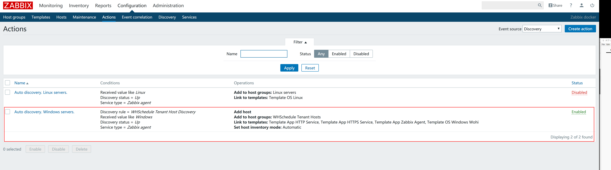
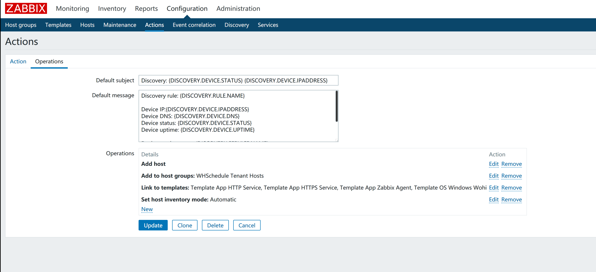

<!-- START doctoc generated TOC please keep comment here to allow auto update -->
<!-- DON'T EDIT THIS SECTION, INSTEAD RE-RUN doctoc TO UPDATE -->
**Table of Contents**  *generated with [DocToc](https://github.com/thlorenz/doctoc)*

- [关于12.1服务器的配置](#%E5%85%B3%E4%BA%8E121%E6%9C%8D%E5%8A%A1%E5%99%A8%E7%9A%84%E9%85%8D%E7%BD%AE)
  - [服务器](#%E6%9C%8D%E5%8A%A1%E5%99%A8)
  - [Zabbix 监控](#zabbix-%E7%9B%91%E6%8E%A7)
    - [Administration - General - Regular expression - Network interface for discovery wohi](#administration---general---regular-expression---network-interface-for-discovery-wohi)
    - [Configuration - Discovery](#configuration---discovery)
    - [Configuration - Actions - Discovery](#configuration---actions---discovery)
    - [Configuration - Aciton - Auto registration](#configuration---aciton---auto-registration)
    - [监控模板](#%E7%9B%91%E6%8E%A7%E6%A8%A1%E6%9D%BF)
  - [SINOPIA ——私有NPM仓库](#sinopia-%E7%A7%81%E6%9C%89npm%E4%BB%93%E5%BA%93)
    - [Docker run](#docker-run)
    - [Backups](#backups)
    - [Restore](#restore)
  - [L2TP-VPN-SERVER](#l2tp-vpn-server)

<!-- END doctoc generated TOC please keep comment here to allow auto update -->

# 关于12.1服务器的配置

edit-by：王进波 2018.08.12

> IP : 192.168.12.1
>
> Mac Address : e0:d5:5e:51:64:48
>
> LSB Version:    :core-4.1-amd64:core-4.1-noarch:cxx-4.1-amd64:cxx-4.1-noarch:desktop-4.1-amd64:desktop-4.1-noarch:languages-4.1-amd64:languages-4.1-noarch:printing-4.1-amd64:printing-4.1-noarch
>
> Distributor ID: CentOS
>
> Description:    CentOS Linux release 7.5.1804 (Core) 
>
> Release:        7.5.1804
>
> Codename:       Core


## 服务器

12.1是代码服务器，用 Docker 运行了 Gitlab-server 。

除此之外，Docker中还运行着 Zabbix 监控服务器，Sinopia（私有npm仓库），l2tp-vpn-server

查看正在运行的容器的本地image镜像，命令如下：

```shell
[gitlab@gitlabserver ~]$ sudo docker image ls
```

查看正在运行的Docker容器，命令如下：

```shell
[gitlab@gitlabserver ~]$ sudo docker ps
```

其中，Gitlab-server 只使用了一个Docker容器，gitlab（ID：f14446b77bae ），这个容器包含了Gitlab-server运行所需的全部服务。

Gitlab-server的Docker容器在删除并重新Run以后882端口失效的问题可以看这里 [Gitlab 8822端口失效问题](./Gitlab 8822端口失效问题.md) 

Zabbix 监控服务的部署使用了3个Docker容器，分别是zabbixserver（ID：9d2e28d10ae4），zabbix-web-nginx-mysql（ID：8eb1ecab6adf），mysql（ID：dbc1348c8c51 ），zabbixserver是监控服务，zabbix-web-nginx-mysql是web前端配置界面，mysql是zabbix数据库，也可以为其他服务提供基础存储服务


从Image镜像启动容器的脚本如下

gitlab（f14446b77bae）

```shell
sudo docker run --detach \
    --hostname gitlab.example.com \
    --publish 443:443 \
    --publish 80:80 \
    --publish 22:22 \
    --publish 8880:8880 \
    --publish 8443:8443 \
    --publish 8822:8822 \
    --name gitlab \
    --restart always \
    --volume /srv/gitlab/config:/etc/gitlab \
    --volume /srv/gitlab/logs:/var/log/gitlab \
    --volume /srv/gitlab/data:/var/opt/gitlab \
    registry.docker-cn.com/gitlab/gitlab-ce:latest
```

mysql （dbc1348c8c51），启动参数中关于zabbix的内容是让mysql容器启动时为zabbix监控服务创建数据库

```shell
sudo docker run --name mysql \
--restart always \
-v /srv/mysql/data:/var/lib/mysql \
-p 3306:3306 \
-e MYSQL_ROOT_PASSWORD=000000 \
-e MYSQL_DATABASE='zabbix' \
-e MYSQL_USER='zabbix' \
-e MYSQL_PASSWORD='zabbix' \
-d registry.docker-cn.com/library/mysql:5.7
```

zabbixserver（9d2e28d10ae4）

```shell
sudo docker run --name zabbixserver \
--restart always \
-p 10051:10051 \
-e DB_SERVER_HOST="192.168.12.1" \
-e MYSQL_ROOT_PASSWORD="000000" \
-e MYSQL_DATABASE="zabbix" \
-e MYSQL_USER="zabbix" \
-e MYSQL_PASSWORD="zabbix" \
-d registry.docker-cn.com/zabbix/zabbix-server-mysql:latest
```

zabbix-web-nginx-mysql（8eb1ecab6adf）

```shell
sudo docker run --name zabbix-web-nginx-mysql \
--restart always \
-p 8000:80 \
-p 8043:443 \
-e DB_SERVER_HOST="192.168.12.1" \
-e MYSQL_USER="zabbix" \
-e MYSQL_PASSWORD="zabbix" \
-e ZBX_SERVER_HOST="10051" \
-e PHP_TZ="Asia/Shanghai" \
-d registry.docker-cn.com/zabbix/zabbix-web-nginx-mysql:latest
```


## Zabbix 监控

Zabbix监控服务有一个可配置的Web前端，发布在http://192.168.12.1:8000，管理员帐号为 Admin/zabbix

还原配置的重要参考如下

### Administration - General - Regular expression - Network interface for discovery wohi

需要在网络设备相关的正则表达式中增加一项，用于过滤无关网络设备，如图


新增正则表达式，为假

```shell
^(window|kinboy|RAS|VMware|TeamViewer|WAN|Microsoft|TAP-Windows|4G|Apple|Bluetooth)|(.*Pseudo-Interface.*|.*QoS.*|.*Bandwidth.*|.*WFP.*|.*Native.*|.*Virtual.*)
```

### Configuration - Discovery

新增发现规则，按图配置即可


### Configuration - Actions - Discovery

新增自动发现Action，按图配置即可







### Configuration - Aciton - Auto registration


### 监控模板

监控模板可以导入导出，我导出的模板文件在 [这里](https://civgit.vicp.net:8443/wangjinbo/Svn-to-Git/blob/master/%E5%B7%A5%E5%85%B7/zbx_export_templates.xml)。 下载后在导入界面导入即可，导入成功后还需要增加一项监控项原型。

Configuration - Template - Template OS Windows Wohi - Discovery roles - Network interface discovery - item prototypes，如图


新增一项


上图中 key 值如下，该项用于获取服务器的网卡名称

```shell
wmi.get["root\cimv2","select macaddress from Win32_NetworkAdapter where Name = '{#IFNAME}'"]
```


## SINOPIA ——私有NPM仓库

访问地址：192.168.12.1:4873

### Docker run

```shell
sudo docker run --name sinopia -d -p 4873:4873 keyvanfatehi/sinopia:latest
```

### Backups

```
docker run --volumes-from sinopia -v $(pwd):/backup ubuntu tar cvf /backup/backup.tar /opt/sinopia
```

Alternatively, host path for /opt/sinopia can be determined by running:

```
docker inspect sinopia
```

### Restore

```
docker stop sinopia
docker rm sinopia
docker run --name sinopia -d -p 4873:4873 keyvanfatehi/sinopia:latest
docker stop sinopia
docker run --volumes-from sinopia -v $(pwd):/backup ubuntu tar xvf /backup/backup.tar
docker start sinopia
```


## L2TP-VPN-SERVER

```shell
docker run \
    --name ipsec-server \
    --env-file ./vpn.env \
    --restart=always \
    -p 500:500/udp \
    -p 4500:4500/udp \
    -v /lib/modules:/lib/modules:ro \
    -d --privileged \
    hwdsl2/ipsec-vpn-server
```

查看状态

```shell
docker exec -it ipsec-vpn-server ipsec status
```

查看连接

```shell
docker exec -it ipsec-vpn-server ipsec whack --trafficstatus
```

