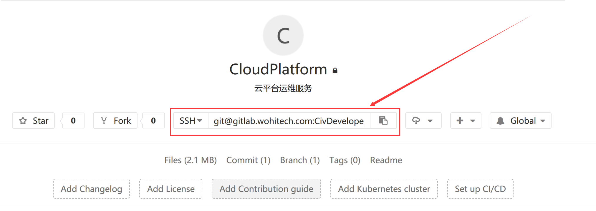

# 关于Gitlab域名更换问题

更新原 `Gitlab` 私有仓库域名 `civgit.vicp.net:8443` 为 `gitlab.wohitech.com` 

也就是说，原来在浏览器中访问 `https://civgit.vicp.net:8443` 或者 `http://civgit.vicp.net:8880` 可以打开 `Gitlab` 网页，现在在`公司内网`仍然可以通过上面两个地址打开，`外网环境`打不开了。

`外网环境`可以通过新网址 `gitlab.wohitech.com` 打开。 

**面向实施部署的说明文档已更新，在[这里](./部署环境搭建--面向实施.md)**

### 原因

​	之前用的花生壳动态域名解析到公司内外网交换路由，再用端口映射到内网 `Gitlab` 服务器，这种方式没有办法使用安全的 `https` 证书，自签名证书在内网使用没有问题，外网环境下发现客户环境中无法访问 `https`，应该与不安全的自签名证书有关，于是将域名改为公司腾讯云子域名，使用安全免费的证书签名，在客户机器上可以访问，可以下载，今后使用 `gitlab.wohitech.com` 访问时，浏览器也不会提示不安全了

### 影响

域名更新后，访问 `Gitlab` 网页，找到任意一个仓库，进入仓库主页，可以看到如下变化：



1. 仓库地址变了，注意域名部分的变化

原来的 `https` 地址从 `https://civgit.vicp.net:8443/CivDevelope/CloudPlatform.git` 变成了 `https://gitlab.wohitech.com/CivDevelope/CloudPlatform.git` ；

原来的 `ssh` 地址从 `ssh://git@civgit.vicp.net:8822/CivDevelope/CloudPlatform.git` 变成了 `ssh://git@gitlab.wohitech.com:CivDevelope/CloudPlatform.git` 


​	上面红线框住的 URL 是我们 `clone` 仓库时使用的 URL ，也是我们更新代码时 `git pull origin develop` 和 推送代码时`git push origin develop` 命令中 `origin` 指向 的仓库地址，我们可以用 `git remove -v` 命令来查看自己本地仓库中的 `origin` 绑定的 URL，应该是更新前域名为  `civgit.vicp.net:8443` 或者 `civgit.vicp.net:8822` 的地址。


### 问题及解决办法

​	这两个旧的URL（指 https 和 ssh 对应的 URL）在公司内网仍然可以用于更新（`git pull`） 和 推送 （`git push`） 代码，也就是说，不用出差的研发，在公司不用做 任何修改，感觉不到变化。

​	如果出差，或者在外网环境需要更新或推送代码时，遇到网络错误，可以将本地的 `origin` 指向新的 URL，即可解决问题。更新 `origin` 的操作如下：

```shell
git remote remove origin;	# 这一步删除旧的 origin
git remote add origin https://example.com/group/somerepo.git #这一步添加新的 origin，新的 url 去 gitlab 仓库拷贝
```

​	对于实施那边已经在外面部署的项目，也可以通过上面这两条命令来更新 `origin` 。


### 内网下速度优化的建议

​	内网环境下 `clone` 代码时，如果使用 `gitlab.wohitech.com` 域名，则会通过外网的阿里云服务器代理，速度比较慢，这时我们可以手动修改仓库的 URL ，例如 使用 `HTTPS` 时，将 `https://gitlab.wohitech.com/group/reponame.git` 改成 `https://civgit.vicp.net:8443/group/reponame.git` ，使用 `SSH` 时将 `git@gitlab.wohitech.com:group/reponame.git` 改为 `git@civgit.vicp.net:8822/group/reponame.git`，这样可以强制走内网，下载速度可能达到 **30 ~ 50 Mbps** 


使用阿里云反代后出现大仓库 `clone` 失败的问题，出错如下：

```shell
Administrator@WIN-T322BR19JV7 MINGW64 /d/00GitSation
$  git clone https://gitlab.wohitech.com/CivPublish/CivWebPublish.git
Cloning into 'CivWebPublish'...
remote: Counting objects: 63936, done.
remote: Compressing objects: 100% (50/50), done.
fatal: The remote end hung up unexpectedly3.89 MiB | 600.00 KiB/s
fatal: early EOF
fatal: index-pack failed
```

查找资料，是 Nginx 设置问题，参照 [这里](https://www.scalescale.com/tips/nginx/optimizing-nginx-for-serving-files-bigger-than-1gb/) 的解决办法，解决问题

