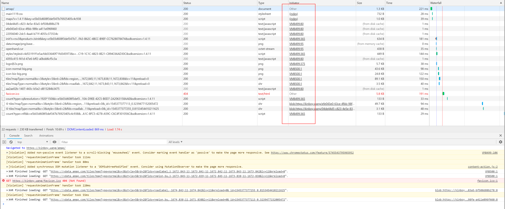
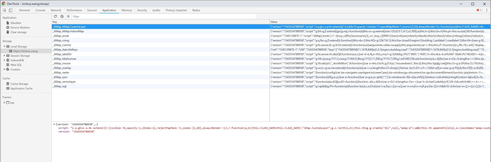
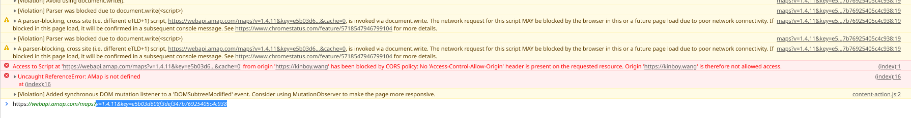
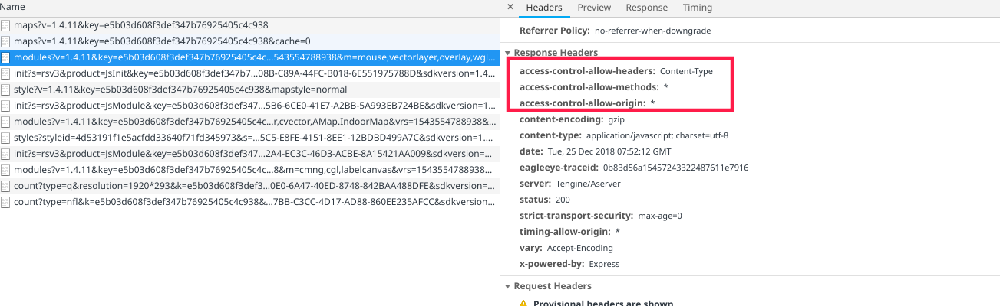
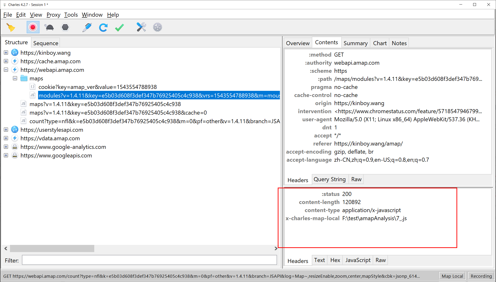

# 分析高德地图行政区注记数据

## 制作分析样本

- [高德地图开放平台注册开发者账号](https://lbs.amap.com/getting-started/mapstyle)  
- 创建应用，获得key `e5b03d608f3def347b76925405c4c938` 
- 创建自定义图层，从标准图层中去除无关数据，保留 省级以下 `兴趣点标注`
- 发布自定义图层，获得样式ID `4d53191f1e5acfdd33640f71fd345973`
- 新建地图展示环境，https://kinboy.wang/amap，代码如下：

```html
<!doctype html>
<html>
<head>
    <meta charset="utf-8">
    <meta http-equiv="X-UA-Compatible" content="IE=edge">
    <meta name="viewport" content="initial-scale=1.0, user-scalable=no, width=device-width">
    <title>自定义地图</title>
    <link rel="stylesheet" href="https://cache.amap.com/lbs/static/main1119.css"/>
   <script src="https://webapi.amap.com/maps?v=1.4.11&key=e5b03d608f3def347b76925405c4c938"></script>
   <!--<script type="text/javascript" src="https://cache.amap.com/lbs/static/addToolbar.js"></script>-->
</head>
<body>
<div id="container"></div>

<script>
    var map = new AMap.Map('container', {
        resizeEnable: true,
        zoom:11,
        center: [114.298572, 30.584355],
        mapStyle:'amap://styles/4d53191f1e5acfdd33640f71fd345973'
        //前往创建自定义地图样式：https://lbs.amap.com/dev/mapstyle/index
    });

</script>
</body>
</html>

```


## 分析过程记录





JS加载使用了动态注入的方式，在第一次请求时，将压缩混淆的 js 字符串保存在浏览器的 `localStorage` 中，然后用 `eval()` 函数将 js 字符串注入到环境中。

动态注入的 js 会被丢到 Chrome Debugger 的 vm 中，难于调试。

## 思路

由于代码经过压缩和混淆，难于调试，需要想办法将代码转义成语义化的代码，可以将 js 请求的响应保存为本地文件，然后使用 Fiddler 将 js 请求拦截下来，用保存在本地的问题替换服务器响应，这样，可以持续修改本地文件，来不断深入分析代码。


这里，拦截工具，我使用了 Charles ，按道理，Fiddler 也可以实现，而且更加强大，不过由于一开始遇到坑时，我就换了 Charles ，然后在 Charles 上走通了，我就没有再尝试 Fiddler了。


按照这种思路，当我们替换请求响应为保存在本地的文件时，清理缓存后刷新页面，会出现跨域的错误



出现错误的请求，正是被我将响应替换为本地文件的那个请求。

根据错误提示，原因很明显，是因为请求的响应头中没有出现 `Access-Control-Allow-Origin` 头部， https://kinboy.wang 这个域名访问这个资源是跨域请求，不被浏览器允许。

当我关闭拦截，让请求正常发送到服务器时，可以看到，正常请求的响应头中是包含了 `Access-Control-Allow-Origin` 相关的头部的。




再看看拦截请求的情况下 ，Charles 中生成的响应的头部，可以看到，被 Charles 拦截后，生成的响应中的确不包含 `Access-Control-Allow-Origin` 头部，不出意外，应该加上相应头部就可以解决问题。




一般这样的代理工具都有自定义 HTTP 请求的功能，这是基础功能。在 Charles 中，这个功能叫作 `rewrite` 。

我用 `rewrite` 功能把需要拦截的几个请求分别自定义设置了响应头，按照正常响应的头部来设置，然后完美解决问题，Charles 截获请求后，将指定好的本地文件作为请求的响应返回给浏览器了，并且没有报错。


那么接下来就可以继续分析代码了。。