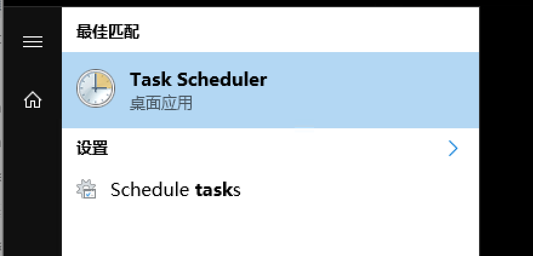
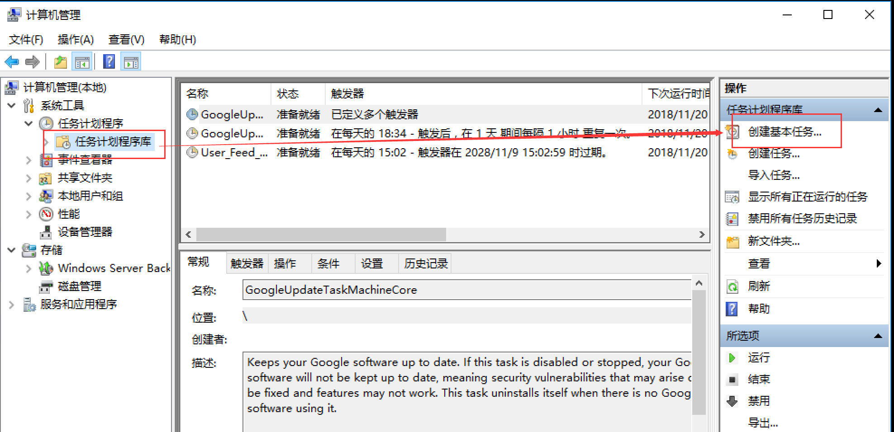
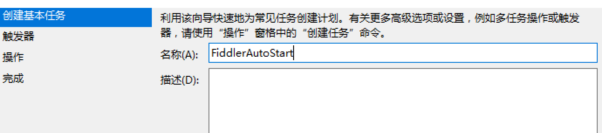
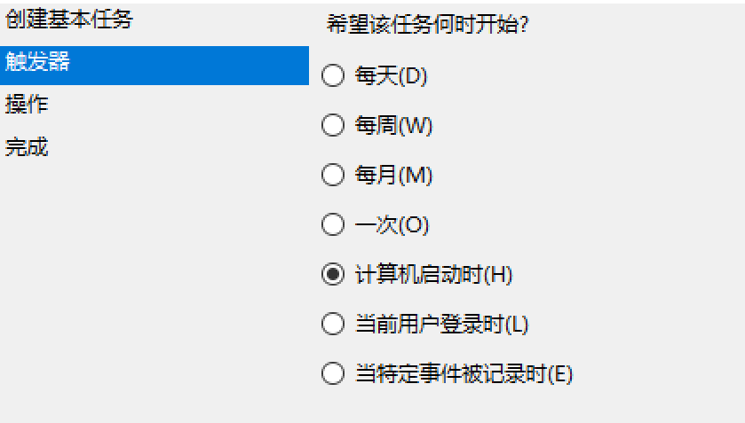
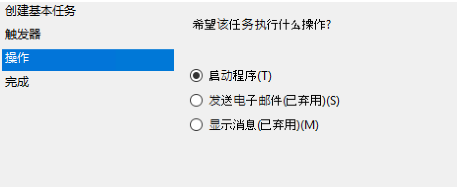
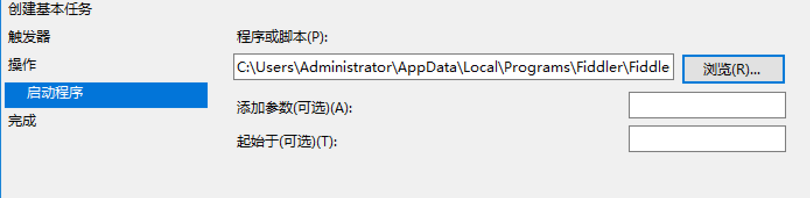
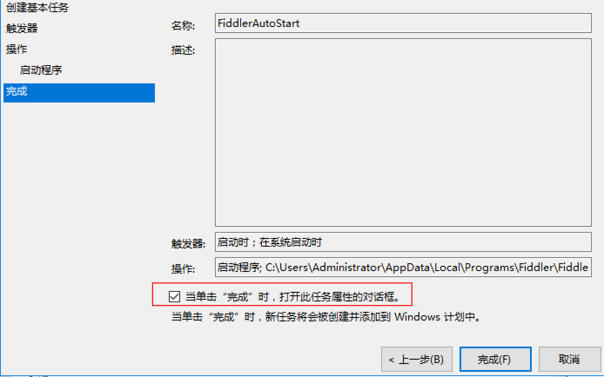
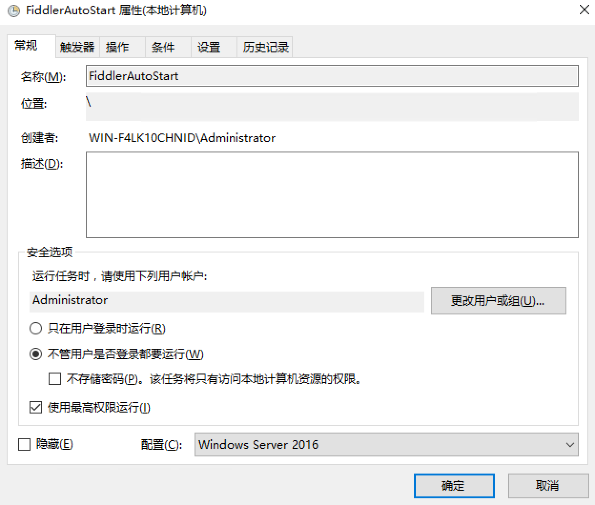
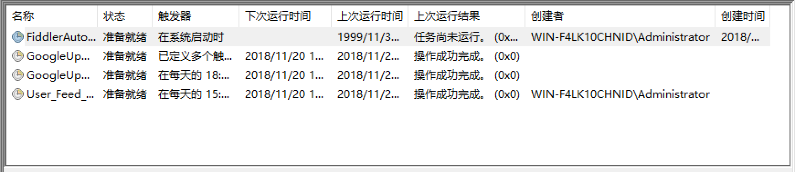

# 创建交互式Task Scheduler

12.12 上运行了一个 Fiddler 代理的 GUI 进程用来提供[营收系统](hbtsoft.wohitech.com/commin/main)的代理服务，主要代理的营收系统的登录操作和一些样式文件，需要24小时运行。

但是偶尔因为某些原因，服务器会需要重启，但是重启的人可能并不知道哪些东西是需要在重启后要打开的，于是就出现了 营收系统 无法访问的问题，于是就要手动远程到服务器中，找到 Fiddler.exe ，双击启动 GUI 进程，这时 营收系统才恢复了访问。

我想利用 Windows 自动的任务计划服务，Task Scheduler 来让 Fiddler 的 GUI  进程在每次重启开机后自动启动，这样即降低了 营收系统 不可访问的概率，也省了远程服务器启动进程这样繁琐的工作。

经过一番折腾，我将创建过程和坑记录如下，其他有需要的程序可以参考

### 启动 Task Scheduler

开始菜单搜索 `Task Scheduler` 

或者运行命令 `compmgmt.msc` 打开计算机管理控制台，找到 **任务计划程序库**，创建基本任务

### 命名基本任务

  

### 配置触发规则

设置为计算机启动时触发

 

### 配置触发操作

选择执行程序

 

### 指定启动程序 `exe` 文件的路径

这里找到 Fiddler.exe 这个可执行文件，不知道安装在什么地方，可以通过右键快捷方式，打开位置来找到快捷方式对应的应用程序路径。

下面两项不用填写，如果要启动的是需要接受参数的命令行程序，就需要在下面加上参数

 

### 检查配置

勾选那个打开属性对话框的选项，点完成结束编辑

 

### 继续配置任务详细信息，这里有坑

在安全选项里面，按照我们的需求，重启计算机后，我们希望不论是否登录系统，都要启动 Fiddler 的 GUI 进程。所以，我们按照这个需求来设置，安全选项中选中 `不管用户是否登录都要运行`，建议使用最高权限运行，配置使用 Windows Server 2016。其他配置这里暂不修改，点确定完成

 

此时会弹出一个登录验证，登录就可以了

### 测试

如此配置后，在任务列表中就能看到 `FiddlerAutoStart` 的任务了，选中任务，右键运行，可以手动触发该任务

 

运行后，我发现 `taskmgr` 中可以看到 Fiddler 进程启动了，但是营收系统仍然无法访问。

一番 Google 后找到了微软的[官方文档](https://docs.microsoft.com/en-us/previous-versions/windows/it-pro/windows-server-2008-R2-and-2008/cc722152(v=ws.11))，描述如下 

>You can specify that a task should run even if the account under which the task is scheduled to run is not logged on when the task is triggered. To do this, select the radio button labeled Run whether user is logged on or not . If this radio button is selected, tasks will not run interactively. To make a task run interactively, select the Run only when user is logged on radio button.

意思是，如果在安全选项那里，勾选了`不论用户是否登录都要运行程序` ，那么这个任务就会以非交互式会话启动 Fiddler GUI 进程，如果想要交互式启动 Fiddler ，就要选择 `只在用户登录时运行` 。

也就是说，如果我们希望计算机重启后自动启动 GUI 进程的话，就需要在用户登录时启动，这可能是操作系统的限制，跟我们最初的需求有一些偏差，但是也算是一个折中的解决办法了，重启后只要有人远程服务器，进程就会启动，听起来也还不错。

按照文档所说的方式修改后，执行上面的 **测试** 步骤，发现任务执行后，并没有在操作系统界面中启动 GUI ，`taskmgr` 中可以看到 Fiddler 进程在运行，现在访问 营收系统，可以成功了。

ps：一开始想到用 `nssm` 这种壳工具将 Fiddler 主程序安装成一个 windows 服务，尝试后失败了，现在来看其实解释了失败的原因，我们用 `nssm` 启动 Fiddler 进程时其实也是创建的 非交互式 进程，因为Windows 服务本身就是非交互式的。