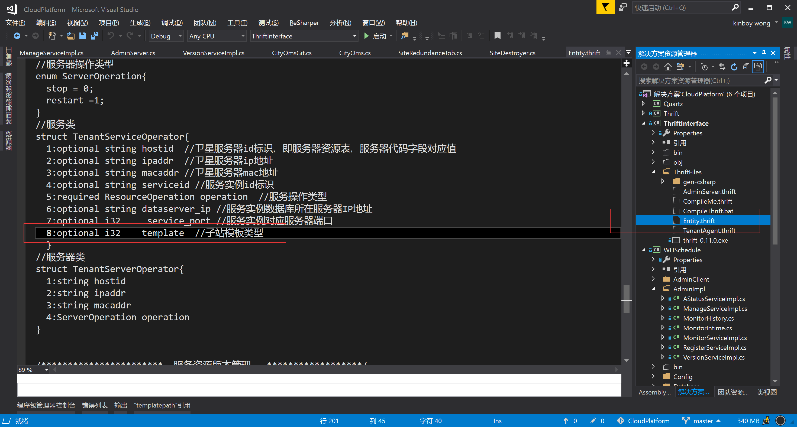
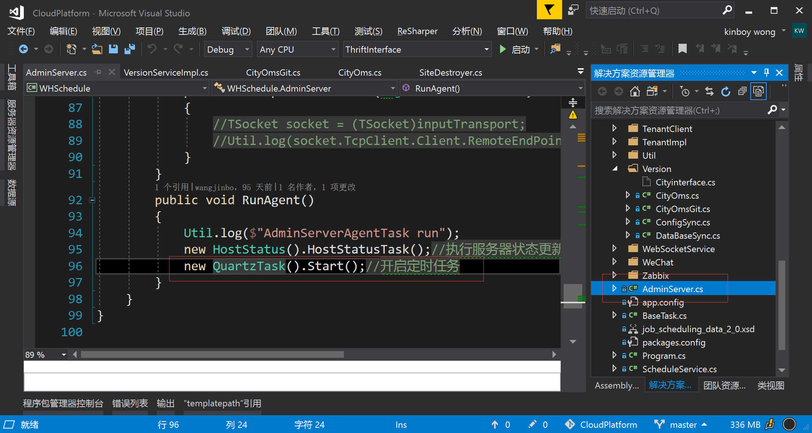
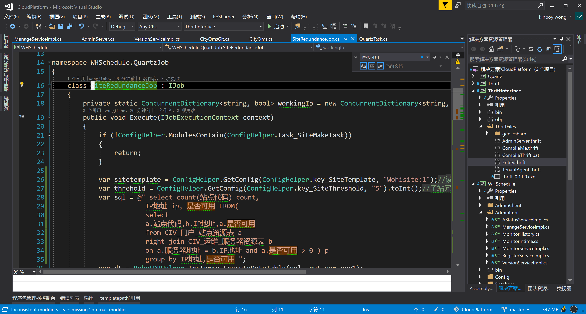
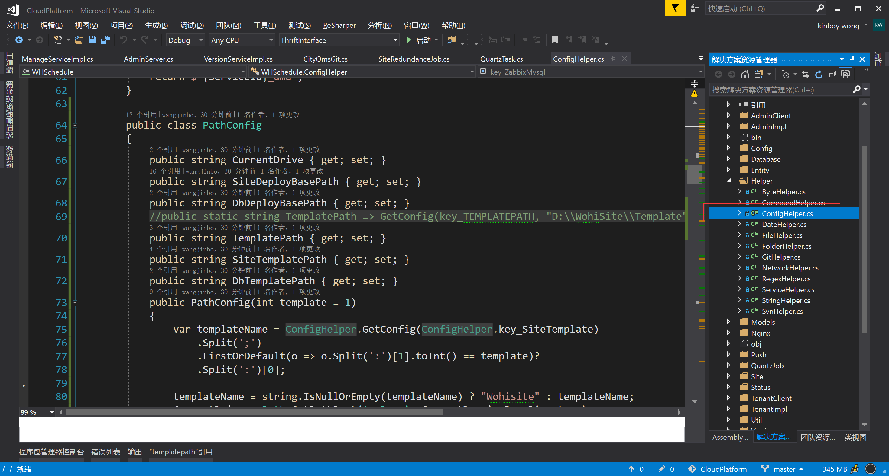

# 子站多模板更新

1:手动创建子站增加接口参数，传入子站模板类型，类型值为 **站点资源表.是否可用**  字段的值，当子站被企业注册后，会改为0 

2:AdminServer和TenentServer 的配置文件中增加共享配置项，SiteTemplate，格式为"Wohisite:1;Wohisite_pressure:2”,用于关联模板名称与数据库表中的类型值 

3:自动创建站点的逻辑改变，主要在SiteRedundanceJob.cs文件中 

4:创建和销毁站点的代码中与路径有关的代码变动较大，原来的静态类型路径改为非静态类型，根据子站模板类型实例化后使用 

5:子站更新代码也有所变动，主要在CityOms.cs 和  CityOmsGit.cs 文件中，同样将静态路径改为需要根据子站类型实例化的路径

### 新增接口参数



### 自动创建子站的代码起始位置



自动创建站点中的过滤逻辑改动主要在 `SiteRedundanceJob` 的 `Execute` 方法里




### 路径相关的修改位置

路径是之前创建站点的逻辑中比较重要的部分，站点创建，销毁，更新等多处都会使用，我专门创建了一个配置类用来管理配置，之前不考虑多套模板的情况下，使用了静态的路径数据，现在为了支持多套模板，和并发环境下的操作，必须在每一次涉及到路径的操作时实例化一个路径的参数类型，此处创建了一个 PathConfig类型，引用该类文件的多处代码都改了一遍，具体记不清位置




### 部署

此次修改后部署时，除了更新编译的动态库到 12.8 服务器上的 D:/AdminServer 和 D:/TenantServer 路径下以外，还需要分别在两处的配置文件（WohiScheduleService.exe.config）中新增配置项

```xml
 <!--SiteTemplate 子站模板配置，Wohisite:1,wohisites_pressure:2,不同模板对应站点资源表中“是否可用”的不同状态，默认只有wohisite:1-->
 <add key="SiteTemplate" value="wohisite:1;wohisite_pressure:2"/>
```

配置格式为，不同模板用分号 `;` 分隔，模板内部的模板文件夹名称与标识用冒号分隔 `:` 。标识对应 **站点资源表** 中的是否可用字段

切不可覆盖配置文件，配置除此处需要修改以外，其他地方不需要改动

`p.s.` AdminServer 和 TenantServer 两个服务是使用的同一套代码，也就是说，编译生成的动态库，需要同时更新到两个服务中，两套服务的逻辑是通过配置文件来控制其所属的角色的