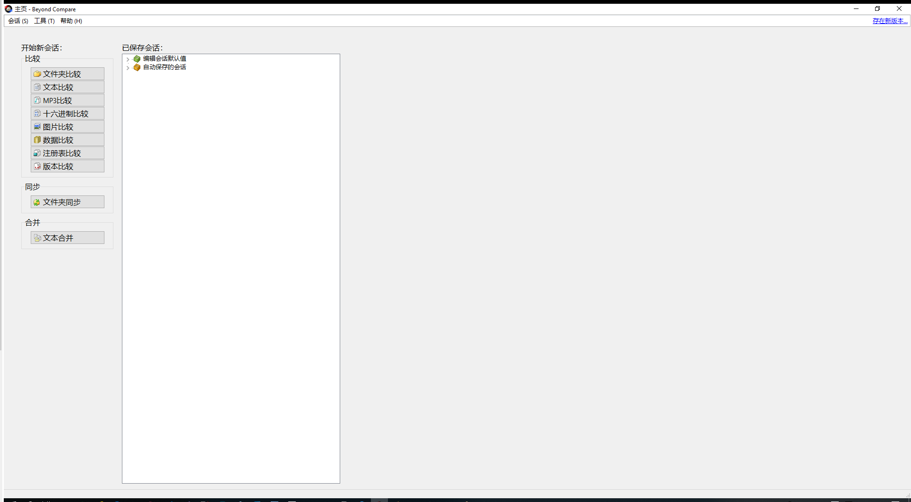
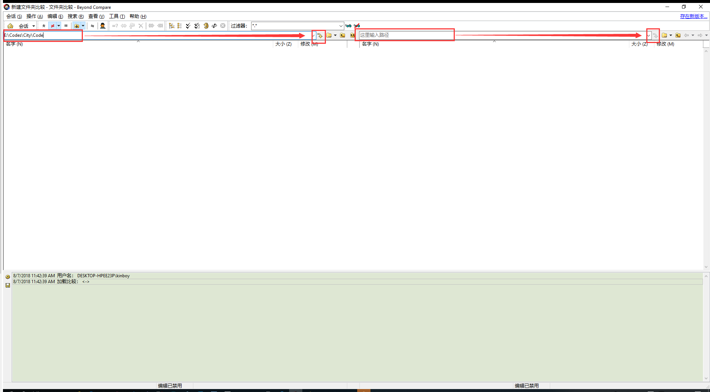
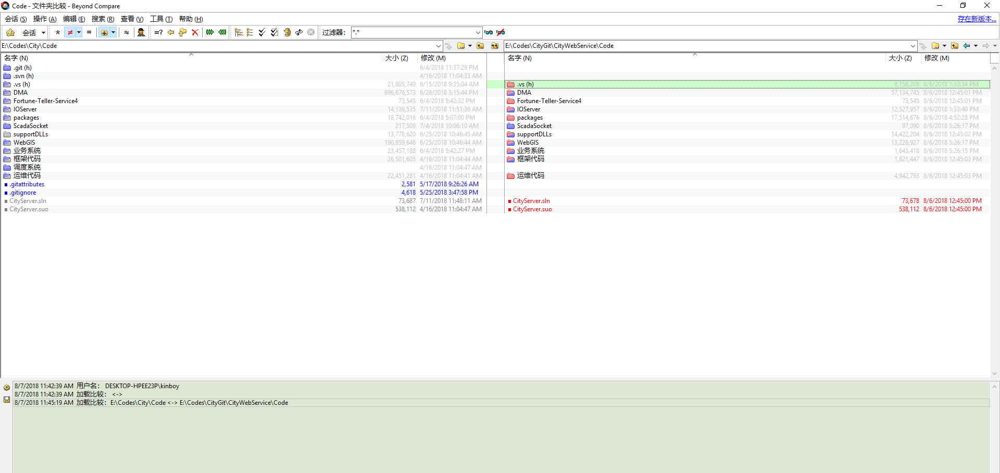
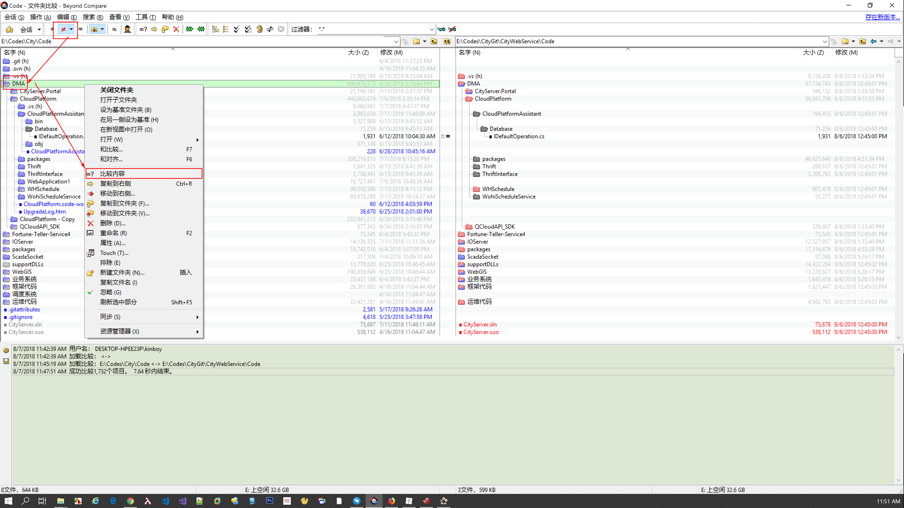
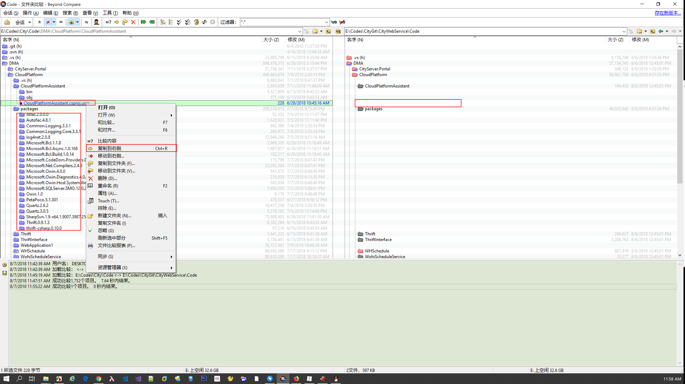
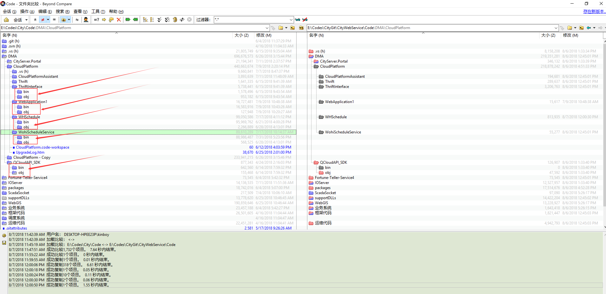

<!-- START doctoc generated TOC please keep comment here to allow auto update -->
<!-- DON'T EDIT THIS SECTION, INSTEAD RE-RUN doctoc TO UPDATE -->
**Table of Contents**  *generated with [DocToc](https://github.com/thlorenz/doctoc)*

- [签出正式开发代码，同步修改，提交](#%E7%AD%BE%E5%87%BA%E6%AD%A3%E5%BC%8F%E5%BC%80%E5%8F%91%E4%BB%A3%E7%A0%81%E5%90%8C%E6%AD%A5%E4%BF%AE%E6%94%B9%E6%8F%90%E4%BA%A4)
  - [检查新增分组和代码](#%E6%A3%80%E6%9F%A5%E6%96%B0%E5%A2%9E%E5%88%86%E7%BB%84%E5%92%8C%E4%BB%A3%E7%A0%81)
  - [签出CityWebService和Web4](#%E7%AD%BE%E5%87%BAcitywebservice%E5%92%8Cweb4)
  - [创建自己的开发分支](#%E5%88%9B%E5%BB%BA%E8%87%AA%E5%B7%B1%E7%9A%84%E5%BC%80%E5%8F%91%E5%88%86%E6%94%AF)
  - [同步修改](#%E5%90%8C%E6%AD%A5%E4%BF%AE%E6%94%B9)
  - [添加`.gitignore`文件](#%E6%B7%BB%E5%8A%A0gitignore%E6%96%87%E4%BB%B6)
  - [提交修改](#%E6%8F%90%E4%BA%A4%E4%BF%AE%E6%94%B9)
  - [同步远程分支](#%E5%90%8C%E6%AD%A5%E8%BF%9C%E7%A8%8B%E5%88%86%E6%94%AF)
  - [合并主分支（develop分支）](#%E5%90%88%E5%B9%B6%E4%B8%BB%E5%88%86%E6%94%AFdevelop%E5%88%86%E6%94%AF)

<!-- END doctoc generated TOC please keep comment here to allow auto update -->

# 签出正式开发代码，同步修改，提交

edit-by：王进波 2018.08.06


## 检查新增分组和代码

打开Gitlab网页：http://civgit.vicp.net:8880  进入CivDevelop分组


## 签出CityWebService和Web4

用git命令或者gui工具签出代码

开发人员只需要迁出develop分支，我们今后所有开发任务都以develop分支为主线，master作为稳定归档分支，不允许开发人员提交更新和合并请求。

检出CityWebService后端代码

```shell
git clone -b develop https://civgit.vicp.net:8443/CivDevelope/CityWebService.git	#检出develop分支
cd CityWebService 
git branch	#查看本地当前分支，是develop
git branch -a	#查看本地和远程的全部分支
```

检出Web4前端代码

```shell
git clone -b develop https://civgit.vicp.net:8443/CivDevelope/Web4.git	
cd Web4
git branch
git branch -a
```


## 创建自己的开发分支

```shell
cd CityWebService	#cd到自己的working copy
git branch	#查看当前本地分支
git checkout -b dev-yourname	#创建自己名字命名的本地开发分支，命名格式为dev—名字全拼
git branch	#现在可以看到我们已经在自己的开发分支上了
```

```SHELL
cd Web4		#cd到Web4的workingcopy
git branch	#查看working copy当前所在分支
git checkout -b dev-yourname	#创建自己名字命名的本地开发分支，命名格式为dev-名称全拼
git branch	#检查当前所在分支
```

所以大多数时候，我们本地只有两个分支，一个是develop分支，一个是dev-yourname分支，我们在dev-yourname分支上完成开发，将代码提交后，从dev-yourname分支merge到develop分支上去，便完成了一次短暂的分支开发生命周期。

在熟练使用分支以后，我们可以尝试在dev-yourname分支上创建feature分支，feature分支代表着我们要完成的一次单独的特性或新功能的开发，我们通过feature分支将代码从dev-develop分支上的代码隔离开来，这样，我们就可以同时并行开发多个功能，并且互相不影响，当feature分支开发完成后，我们将代码merge到dev-yourname分支，然后再merge到develop分支，如此，便完成了一次feature分支开发的生命周期

如果feature分支一般是短期分支，在不需要与他人协作的情况下，我们尽量不要同步到服务器远程分支上去，完成开发并合并到develop分支后，我们就可以将feature分支删除掉了

## 同步修改

用[BeyondCompare](https://civgit.vicp.net:8443/wangjinbo/Svn-to-Git/blob/master/%E5%B7%A5%E5%85%B7/Beyond%20CompareHA.7z)工具对比自己本地代码和从Gitlab clone下来的代码，将本机的改动手动更新到本地Git working copy

BeyondCompare工具我在本项目的工具文件夹中上传了，需要的可以自己[下载](https://civgit.vicp.net:8443/wangjinbo/Svn-to-Git/blob/master/%E5%B7%A5%E5%85%B7/Beyond%20CompareHA.7z)，或者去网上找

> 在这步操作过程中，我们优先同步自己修改的代码部分，对于代码内容存在差异的，如果是我们自己改的，能够判断哪边最新，就可以手动同步，如果不是我们修改的，不能判断的情况下，保留原样，不做修改，以Git目录为准就可以了


> 还有一处需要注意的是，如果存在一个项目或者一个文件夹，你本地开发环境里有，Git环境里没有的话，需要看这部分项目和文件夹是否是之前武汉中地的项目上的代码，因为我们在整理Git代码的时候已经将这一部分项目上的代码删掉了，注意不要在这个地方再次还原回去了
>
> 例如 ”Code/业务系统“ 下的的几个项目，在Git中已经被删除了
>
> - CityServer.Maintenance.ChengDu
> - CityServer.Maintenance.HZBJ
> - CityServer.Maintenance.SXBH
> - CityServer.Maintenance.Wujiang


> 在CityInterface项目中有很多文本内容相同，行尾结束符存在差异的情况，例如一边是UNIX一边是PC，或者一边是MIX一边是PC，**以PC为准**
>
> PC即Windows风格的CRLF，MIX是指当前文件存在UNIX与Windows风格混用的情况。

1. 打开BeyondCompare，对比文件夹
   

2. 在左右两侧地址栏输入对比的代码文件夹路径，打开对比
   
   红色为差异项，需要我们手动确认更新到Git本地working copy中

   

3. 将显示内容设置为显示差异项，然后在差异文件夹上右键，对比文件夹内容（对比文件二进制），然后二进制相同项就会自动隐藏，剩下的是需要我们手动打开查看内容的
   

4. 对于我们在本地开发环境中新增的文件或文件夹，如果不是编译产生的，则可以复制到Git目录一侧，如果是文件内容差异，我们可以将我们在文件中新增的内容复制到Git一侧
   

   

   这样的编译文件目录我们就不要拷贝了
   

   如此，最终我们就完成了将本地开发环境迁移到Git的过程了，建议大家暂时保留原有的开发环境，后续开发我们就可以在Git环境上完成了

   上面示例的是CityWebService的过程，Web4的过程相同。

   

## 添加`.gitignore`文件

   我们在用svn的时候会将不需要添加到版本控制的文件类型通过ignore列表排除掉，在git里面也有相应的机制，需要我们去手动添加和编辑`.gitignore`文件。

   `.gitignore`文件一般位于我们Git工作目录的根目录中，也可以存在于子目录下，左右域也是层级嵌套的，每个`.gitignore`文件对它当前所在目录及其子目录内的文件有效，如果子目录中存在`.gitignore`文件且与外部冲突，则以内部为准。

   我在Gitlab Server中已经添加了`.gitignore`文件，大家clone下来就会有。不需要额外添加了。

   

## 提交修改

   现在我们需要将从自己本地开发环境同步到Git环境所产生的修改进行一次索引和提交，以CityWebService为例

   ```shell
   cd CityWebService
   git status	#查看当前工作目录的状态，红色的行就是当前working copy中还未添加到暂存区（索引） 的修改
   git add .	#我们批量添加Git working copy中的全部修改
   git commit -m "同步Git之前的开发环境中修改的代码"
   ```

## 同步远程分支

完成上一步的`commit`操作后，我们所有的代码修改和更新都还停留在本地的你自己名字命名的开发分支上，打开Gitlab的网页是看不到你的这个本地分支的，我们现在将你本地分支的提交，同步到远程服务器

```shell
git push --set-upstream origin dev-yourname	

# --set-upstream参数是告诉git，用本地的dev-yourname分支追踪远程的origin/dev-yourname分支，只在第一次push时设置一次，后面只需要checkout 到 dev-yourname分支后执行 git push，就会自动将本地dev-yourname 分支推送到远程的 origin/dev-yourname 分支了。

git branch -a	

#查看远程和本地全部分支，现在就可以看到origin/dev-yourname这个分支了，它代表服务器上的dev-develop分支，我们可以通过这种方式来实现代码的远程备份，每个人都可以在服务器上保留自己的开发分支
```


## 合并主分支（develop分支）

我们在dev-yourname分支上完成功能修改后，想要将代码merge到develop分支上去，这时候的操作是这样的

```shell
git checkout develop	# 切换到develop分支
git merge dev-yourname	# 合并本地dev-yourname分支到develop分支
git pull	# 将远程develop分支的最新更新拉取到本地
git push	# 将本地提交推送到远程分支
```

现在可以打开Gitlab的网页，查看分支提交记录，确认我们的操作无误

   

至此，结束
