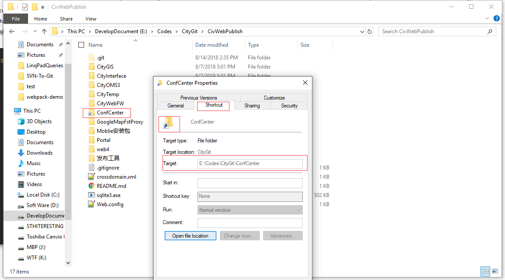

<!-- START doctoc generated TOC please keep comment here to allow auto update -->
<!-- DON'T EDIT THIS SECTION, INSTEAD RE-RUN doctoc TO UPDATE -->
**Table of Contents**  *generated with [DocToc](https://github.com/thlorenz/doctoc)*

- [Web部署环境搭建](#web%E9%83%A8%E7%BD%B2%E7%8E%AF%E5%A2%83%E6%90%AD%E5%BB%BA)
  - [简介](#%E7%AE%80%E4%BB%8B)
  - [全新部署](#%E5%85%A8%E6%96%B0%E9%83%A8%E7%BD%B2)
  - [更新部署](#%E6%9B%B4%E6%96%B0%E9%83%A8%E7%BD%B2)
    - [ConfCenter在CivWebPublish内部](#confcenter%E5%9C%A8civwebpublish%E5%86%85%E9%83%A8)
      - [ConfCenter为文件夹](#confcenter%E4%B8%BA%E6%96%87%E4%BB%B6%E5%A4%B9)
      - [ConfCenter是符号链接](#confcenter%E6%98%AF%E7%AC%A6%E5%8F%B7%E9%93%BE%E6%8E%A5)
    - [ConfCenter在CivWebPublish同级](#confcenter%E5%9C%A8civwebpublish%E5%90%8C%E7%BA%A7)
  - [站点更新操作](#%E7%AB%99%E7%82%B9%E6%9B%B4%E6%96%B0%E6%93%8D%E4%BD%9C)
- [symlink](#symlink)

<!-- END doctoc generated TOC please keep comment here to allow auto update -->

# Web部署环境搭建
edited by 王进波 2018.08.23

## 简介

web 部署环境包括两个部分：

​	1）应用程序库，即CivWebPublish；

​	2）配置中心库，即ConfCenter

分别对应了两个Git仓库，部署时需要分别clone。

CivWebPublish对ConfCenter存在依赖关系，先下载ConfCenter库，ConfCenter与CivWebPublish要在同一级目录下，过去ConfCenter是在CivWebPublish文件夹内的，现在拿出来了。


## 全新部署

如果机器上没有部署过上述两个Git仓库，则认为是全新部署。

全新部署步骤如下：

1. `clone` ConfCenter配置中心库

   用管理员权限启动Cmd命令行，或者PowerShell，或者Git Bash，执行下述命令

   ```shell
   cd <folder name>	#导航到部署文件夹<folder name>下，如果是Cmd命令行，则cd 后面加上 /d 参数
   git clone https://civgit.vicp.net:8443/CivDevelope/ConfCenter.git	#clone ConfCenter
   
   #弹出验证窗口，口令：gitlab+deploy-token-10 密码：tPPy6xZxTU2SYqznimfx
   ```
   完成后先不要关闭命令行界面

2. `clone` CivWebPublish应用程序库

   在上面的命令行中继续执行下述命令

   ```shell
   git config --global core.symlinks true
   git clone https://civgit.vicp.net:8443/CivPublish/CivWebPublish.git
   
   #弹出验证窗口，口令：gitlab+deploy-token-7 密码：jnzGBwuvRvNtxJqSExgV
   ```


## 更新部署

如果机器上已经部署过站点，则认为是更新部署。

更新部署根据部署环境中ConfCenter文件夹的位置分几种情况：

- ConfCenter在CivWebPublish内部，即早期ConfCenter文件夹放在CivWebPublish文件夹里面时部署的站点
- ConfCenter与CivWebPublish同级，即后来ConfCenter文件夹拿到CivWebPublish外面之后部署的站点

### ConfCenter在CivWebPublish内部

辨别CivWebPublish内部的ConfCenter是文件夹还是符号链接，[辨别方法](#symlink)

#### ConfCenter为文件夹

我们保留站点配置，重新clone应用程序库CivWebPublish，具体如下：

1. 将ConfCenter文件夹拷贝到CivWebPublish同级目录下

   

2. 删除CivWebPublish并重新`clone`

   Cmd，或PowerShell，或Git Bash 需要管理员权限启动。

   ``` shell
   cd <folder name>	#导航到部署文件夹<folder name>下，如果是Cmd命令行，则cd 后面加上 /d 参数
   git config --global core.symlinks true
   git clone https://civgit.vicp.net:8443/CivPublish/CivWebPublish.git
   
   #弹出验证窗口，口令：gitlab+deploy-token-7 密码：jnzGBwuvRvNtxJqSExgV
   ```

   `clone`完成后双击CivWebPublish下的ConfCenter符号链接，测试能否正确跳转。

#### ConfCenter是符号链接

如果ConfCenter已经是有效的符号链接，双击能正确跳转，则只需要在执行pull操作弹出验证窗口时输入正确的口令

```shell
#CivWebPublish的远程仓库Url：https://civgit.vicp.net:8443/CivPublish/CivWebPublish.git
#弹出验证窗口，口令：gitlab+deploy-token-7 密码：jnzGBwuvRvNtxJqSExgV
```


### ConfCenter在CivWebPublish同级

ConfCenter文件夹与CivWebPublish同级，则删除CivWebPublish后重新Clone。

用理员权限启动Cmd，或PowerShell，或Git Bash

```shell
cd <folder name>	#导航到部署文件夹<folder name>下，如果是Cmd命令行，则cd 后面加上 /d 参数
git config --global core.symlinks true
git clone https://civgit.vicp.net:8443/CivPublish/CivWebPublish.git

#弹出验证窗口，口令：gitlab+deploy-token-7 密码：jnzGBwuvRvNtxJqSExgV
```

`clone`完成后双击CivWebPublish下的ConfCenter符号链接，测试能否正确跳转。


## 站点更新操作

站点更新只需要更新CivWebPublish文件夹，ConfCenter是配置中心，不通过Git来更新。

更新步骤：

```shell
cd CivWebPublish	#导航到CivWebPublish目录，如果是Cmd命令行，则cd 命令后面加上 /d 参数
git status		#检查本地有没有文件被修改，如果显示有文件修改，则在本地提交修改
git add .
git commit -m "commit for pull"		#这两步提交本地修改

git pull	#从远程仓库拉取更新，检查输出结果是有错
```


# symlink

- 符号链接的文件夹图标左下角有快捷方式的箭头

- 右键属性时可以看到这个文件的Shortcut（快捷方式）属性，并且能看到跳转目标（Target）

  