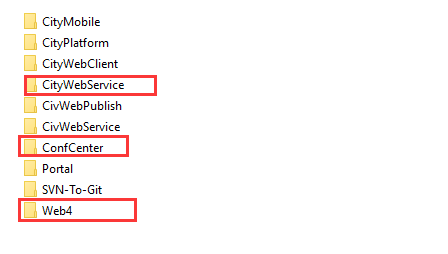
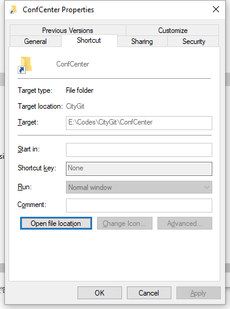

# CityWebService服务代码结构调整

edit-by：王进波-2018.08.10

调整如下：

- 从CityWebService中移除了ConfCenter 和 Web4 文件夹
- 在CivDevelop分组下分别创建了独立的ConfCenter和 Web4 Git仓库
- 在CityWebService下创建 [Symbolic link](https://civpub.vicp.net:8443/wangjinbo/Svn-to-Git/blob/master/%E8%AE%A9Git%E6%94%AF%E6%8C%81Windows%20Symbolic%20link.md) (符号链接)来指向上面移除的两个文件夹

### 对开发环境有什么影响？

1. 要将 ConfCenter 和 Web4 的仓库`clone`到CityWebService同级目录下，如下图

   

2. 要重新`clone` CityWebService的代码，让Symbolic link 生效

   > 具体操作如下：( * 由于创建symbolic links需要管理员权限，所以以下命令需要用管理员权限启动 `CMD`、`Powershell` 或者 `Git Bash`  * )
   >
   > 1. 将自己的分支`dev-yourname`  push到远程的`dev-yourname`分支
   >
   >    ```shell
   >    git push origin dev-yourname
   >    ```
   >
   > 2. 删除本地的CityWebService仓库，也就是上图第一个红框的文件夹
   >
   > 3. 在同样的路径下重新` clone` 该仓库代码
   >
   >    ```shell
   >    git clone -b dev-yourname -c core.symlinks=true <url>		#dev-yourname是你自己的远程分支，<url> 替换成CityWebService的仓库Url
   >    cd CityWebService 	#进入代码目录
   >    git pull origin develop		#从远程develop分支拉取最新的提交，里面包含了Symbolic link
   >    ```
   >
   > 4. 检查`clone`下来的Symbolic link是否有效，在CityWebService/ConfCenter-右键属性-如果该文件类型为快捷方式并且如下图所示，指向的目标是其它路径下的同名文件夹，则标识成功，单击该文件会自动跳转到链接的目录
   >
   >   

